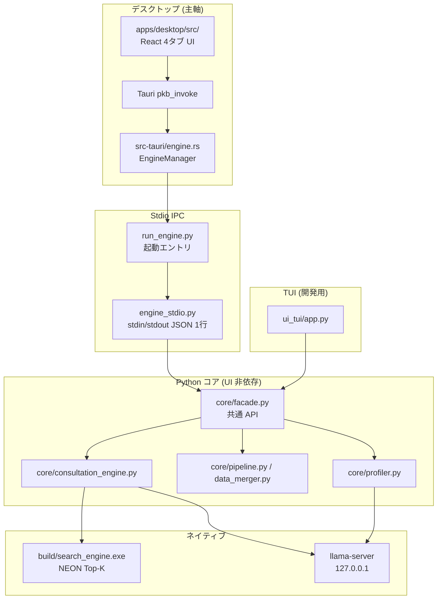

# PKB プロジェクト — コンテキスト引継ぎ (2026-07-06 更新)

> 新規チャットセッションの AI が瞬時に開発再開できるための高密度サマリ。  
> 対象環境: **Snapdragon X / Windows on ARM64**, **Python 3.12-arm64**, **llvm-mingw clang++**。

---

## 1. プロジェクト目的と全体アーキテクチャ

### 目的
**PKB (Personal Knowledge Base)** — 完全オフライン・ローカル完結型の自己エミュレーション・意思決定支援システム。

- 日記・LINE・予定・家計簿・AI相談履歴を統合し、行動ログから深層プロファイルを自動生成
- **CONSULT 送信時のみ** C++ NEON ベクトル検索 + 7B ローカル LLM で 4 セクション回答
- 外部 API 不使用 (`HF_HUB_OFFLINE=1`, llama-server は 127.0.0.1 のみ)

### 製品形態 (2026-07)

| 形態 | 状態 | 備考 |
|---|---|---|
| **デスクトップアプリ** (`apps/desktop/`) | **主軸** | Tauri v2 + React。Python エンジンは stdio JSON IPC |
| Textual TUI (`src/python/ui_tui/app.py`) | 維持 | 開発・デバッグ用。`core/facade.py` を直接呼び出し |
| Web アプリ / ブラウザ配信 | **見送り** | ローカル完結・オフライン設計と相性が悪い |

### 三層アーキテクチャ (フェーズ B 以降)



**デスクトップ IPC フロー (詳細):**

```
React (engine.ts)
  → invoke("pkb_invoke", { cmd, params })
  → Rust EngineManager::invoke_sync()
  → Python 子プロセス stdin へ JSON 1 行
  → engine_stdio.dispatch(cmd, params)
  → core/facade.py
  → stdout へ { id, ok, result } JSON 1 行
```

起動時、Python は stdout へ `{"event":"ready","offline":true}` を送出。  
HTTP サーバーは**使用しない** (llama-server のみ 127.0.0.1)。

**Stdio コマンド一覧** (`engine_stdio.py`):

| cmd | 用途 |
|---|---|
| `health` | 生存確認 |
| `record.load` / `record.save` | 予定・家計簿・日記 |
| `calendar.event_dates` | カレンダーマーク用日付一覧 |
| `calendar.sync` | ICS / Apple カレンダー取込 |
| `import.line` | LINE 履歴 + profiler 自動実行 |
| `consult` | 相談 (検索 + LLM) |
| `settings.get` / `settings.save_fixed` | 基本情報 |
| `settings.run_profiler` | 深層プロファイル再分析 |
| `shutdown` | エンジン停止 |

### 従来パイプライン (コア内部)

```
┌──────────────────────────────────────────────────────────────┐
│  UI / オーケストレーション                                     │
│  apps/desktop/src/          — React + Tauri (主軸)            │
│  src/python/ui_tui/app.py   — Textual TUI (開発用)            │
│  src/python/core/facade.py  — 共通ビジネス API                 │
│  src/python/core/consultation_engine.py — 相談時のみ起動       │
│  src/python/core/pipeline.py       — ベクトル化                │
│  src/python/core/data_merger.py    — DailyContext 結晶化       │
│  src/python/core/profiler.py       — 深層プロファイル          │
│  src/python/core/calendar_manager.py / finance_manager.py    │
│  src/python/core/calendar_sync.py      — ICS 取込              │
│  src/python/core/apple_calendar_sync.py — macOS ローカル DB   │
└────────────────────────┬─────────────────────────────────────┘
                         │ subprocess / mmap / JSON
┌────────────────────────▼─────────────────────────────────────┐
│  検索コア (C++17, ARM NEON + OpenMP)                            │
│  src/cpp/search_engine.cpp → build/search_engine.exe           │
│  AoSoA 384-dim 内積, ローカル Top-K マージ, Windows mmap      │
└────────────────────────┬─────────────────────────────────────┘
                         │ HTTP 127.0.0.1 (相談/プロファイラ時のみ)
┌────────────────────────▼─────────────────────────────────────┐
│  推論 (llama.cpp b9870 ARM64 native)                            │
│  tools/llama-arm64/llama-server.exe                             │
│  models/Qwen2.5-7B-Instruct-Q4_K_M.gguf (優先, 4.68GB)         │
└─────────────────────────────────────────────────────────────────┘
```

### 設計原則

| 原則 | 内容 |
|---|---|
| **記録と相談の分離** | RECORD / カレンダー同期 → `sync_diary_index()` のみ。CONSULT → 検索+LLM |
| **記録と分析の分離** | RECORD / カレンダー同期は profiler 非実行。IMPORT の LINE 取込のみ profiler 自動実行 |
| **手動カレンダー取込** | ICS / Apple は人間がトリガー。クラウド API・バックグラウンド同期なし |
| **完全遅延初期化** | 埋め込み・llama-server は初回 `consult()` / profiler 実行まで起動しない |
| **インデックス mtime 同期** | ソース JSON/md/txt の mtime が古い時のみ `vectors.bin` 再構築 |
| **プロファイル二層** | `fixed_attributes` (手入力・保持) / `inferred_profile` (自動・読取専用) |
| **ゾンビ禁止** | `LlamaServerBackend.stop()` Terminate→Kill + `atexit` + TUI `on_unmount` |
| **UI とコアの分離** | ビジネスロジックは `core/` のみ。UI は `facade` または stdio 経由 |

### データ配置

| 環境 | ルート |
|---|---|
| 開発 | リポジトリ `data/` (`PKB_PROJECT_ROOT` 未設定時) |
| インストール版 | `%LOCALAPPDATA%\PKB\` |
| パス解決 | `core/paths.py` — `PROJECT_ROOT = os.environ.get("PKB_PROJECT_ROOT", ...)` |

---

## 2. コア技術仕様

### 2.1 DailyContext (1日 = 1ベクトルチャンク)

**生成**: `core/data_merger.load_daily_contexts()` — 以下を日付キーで結合:

| ソース | ファイル | セクション |
|---|---|---|
| 予定 | `data/raw/calendar.json` | `## Calendar` |
| 家計簿 | `data/raw/finance.json` | `## Finance (家計簿)` |
| 日記 | `data/raw/diary.md` | `## Diary` |
| AI相談 | `data/raw/ai_consultations.json` | `## AI_Consultations` |
| LINE | `data/raw/line_history.txt` | `## LINE_ConversationSessions` |

**ベクトル化**: `core/pipeline.build_index()` → `data/processed/vectors.bin` + `metadata.json`  
- 384次元 L2正規化 (`paraphrase-multilingual-MiniLM-L12-v2` / オフライン時 hashed n-gram fallback)

### 2.2 ConversationSession (状態保持型)

**生成**: `core/data_merger.extract_conversation_sessions()` — 単純 Stimulus→Response ペアは廃止。

| ルール | 内容 |
|---|---|
| 開始 | 相手発言でセッション開始 |
| 継続 | ユーザー初回返信までクローズしない (24h超可) |
| 確定 | ユーザー返信後 **30分** 空白で1セッション確定 |
| 未返信 | `awaiting_user=True` は確定しない |

### 2.3 C++ AoSoA バイナリ (Python/C++ 完全同期)

```
FileHeader (32B): magic "PKBVEC01", dim=384, lanes=4, num_vectors, num_blocks, block_bytes=6160
VectorBlock (6160B): float data[384][4] + int32 chunk_ids[4]  (パディング=-1)
```

- CLI: `build/search_engine.exe vectors.bin query.bin [top_k]`
- `core/consultation_engine.search_daily()`: 日記+LINE両方の日は **ranking_score × 1.15**

### 2.4 プロファイリング (`core/profiler.py` → `deep_profile.v5`)

**user_profile.json (`user_profile.v2`)**:
```json
{
  "schema": "user_profile.v2",
  "fixed_attributes": { "age", "gender", "height", "weight", "address", "occupation" },
  "inferred_profile": { "meta_narrative", "factual_signals", "abstract_identity", "llm_deep_synthesis" },
  "auto_extracted": { "value_hierarchy", "dominant_biases", "abstract_heuristics", ... }
}
```

**重要**: `fixed_attributes` は CONSULT プロンプトに注入。profiler 分析入力には**未使用** (要望: 注入のみ・上書きなし)。

### 2.5 llm_config.py (`core/llm_config.py`)

```python
PREFERRED_7B = models/Qwen2.5-7B-Instruct-Q4_K_M.gguf
# 環境変数: PKB_LLAMA_THREADS, PKB_LLAMA_CTX, PKB_LLAMA_BATCH, PKB_LLM_PORT, PKB_MODELS_DIR, PKB_LLAMA_DIR
```

### 2.6 相談パイプライン (`core/consultation_engine.py`)

```
consult(query):
  1. embed(query)
  2. sync_diary_index() / sync_knowledge_index()
  3. search_daily(qvec) + search_index(knowledge)
  4. build_prompt (fixed_attributes, inferred_profile, deep_profile, hits, Future Context)
  5. LlamaServerBackend.generate()
  6. consultation_log 保存 → sync_diary_index(force=True)
```

### 2.7 TUI (`src/python/ui_tui/app.py`)

| タブ | 内容 |
|---|---|
| **RECORD** | 週/月カレンダー + **[予定\|家計簿\|日記]** + 保存 (Ctrl+S) |
| **IMPORT** | LINE / ICS / Apple (macOS) |
| **CONSULT** | フル幅チャット |
| **SETTINGS** | fixed_attributes + 読取専用プロフィール + profiler 再分析 |

**互換起動**: `python src/ui/app.py` → `ui_tui/app.py` へ委譲。

**ウィジェット**:
- `ui_tui/calendar_widget.py` — 月/週切替, 予定マーク `*`
- `ui_tui/time_picker.py` — `VerticalRollColumn` + `TimePicker`

### 2.8 デスクトップ UI (`apps/desktop/`)

| ファイル | 役割 |
|---|---|
| `src/App.tsx` | 4 タブシェル、エンジン ready 待機 |
| `src/lib/engine.ts` | `pkb_invoke` ラッパー |
| `src/components/RecordTab.tsx` 等 | TUI 相当機能 |
| `src-tauri/src/engine.rs` | Python 子プロセス + stdio JSON |
| `src-tauri/src/commands.rs` | `pkb_invoke`, `pkb_engine_ready` |
| `src-tauri/src/paths.rs` | データルート、`PKB_PROJECT_ROOT` |

**開発**: `apps/desktop/dev.cmd`  
**リリース**: `build.cmd` → NSIS。エンジン同梱は `scripts/build-engine.ps1` (PyInstaller)。

### 2.9 カレンダー同期 (`core/calendar_sync.py` / `core/apple_calendar_sync.py`)

**共通**: `apply_calendar_import()` → `calendar.json` → `sync_diary_index(force=True)`

| モジュール | 入力 | 主 API |
|---|---|---|
| `calendar_sync.py` | 手動 `.ics` | `parse_ics()`, `merge_calendar()`, `sync_from_ics()` |
| `apple_calendar_sync.py` | macOS SQLite | `sync_from_apple_calendar()` |

---

## 3. 完了済み実装ステータス

### インフラ
- [x] Python 3.12 ARM64 + numpy + sentence-transformers (オフライン fallback あり)
- [x] llvm-mingw clang + OpenMP, llama.cpp ARM64, Qwen2.5-7B Q4_K_M
- [x] **フェーズ B**: `core/` 分離 + `facade.py` 共通 API
- [x] **デスクトップ**: Tauri v2 + React + stdio IPC
- [x] TUI → `ui_tui/` 移行 + `src/ui/app.py` 互換ラッパー

### データ / パイプライン
- [x] DailyContext: Calendar + Finance + Diary + AI_Consultations + LINE Sessions
- [x] ICS / Apple カレンダー同期 + IMPORT タブ (TUI + デスクトップ)
- [x] Future Context (30日) を CONSULT プロンプトに注入

### C++ / ベンチ
- [x] AoSoA NEON 4-lane + OpenMP Top-K + Windows mmap
- [x] `tests/benchmark.py` (PKBVEC01)

### プロファイラ / TUI / デスクトップ
- [x] `deep_profile.v5`, `user_profile.v2`
- [x] 4 タブ TUI + デスクトップ UI 同等機能
- [x] `tests/ui_smoke.py`, カレンダー同期テスト PASS

---

## 4. 次に実装すべきタスク

### 4.1 プロファイル連携の強化
- [ ] **fixed_attributes を profiler LLM プロンプトに注入** (分析文脈として。上書きはしない)
- [ ] 基本情報保存時の自動 profiler 再実行 (任意)

### 4.2 RECORD / カレンダー UX
- [ ] 家計簿入力日・相談日のカレンダーマーク (現状は予定 `*` のみ)
- [ ] CONSULT 回答の **streaming 表示** (デスクトップ)

### 4.3 分析・品質
- [ ] `data_merger` 未返信セッション (`awaiting_user`) の UI 表示
- [ ] CI: `tests/ui_smoke.py` + `tests/boost_check.py` + `tests/benchmark.py --quick`
- [ ] 実機 ARM64 benchmark フルサイズ計測

### 4.4 バックログ
- [ ] Apple カレンダー DB スキーマ変更への追従
- [ ] CONSULT stdio 経由の status コールバック (進捗表示)

---

## 5. クイックスタート

```powershell
cd C:\Users\badger\Documents\cursur\decision_engine

# デスクトップ (推奨)
cd apps\desktop
.\dev.cmd

# TUI
python src\python\ui_tui\app.py

# パイプライン / プロファイラ
python src\python\core\pipeline.py
python src\python\core\profiler.py          # --no-llm 可

# CLI 相談
python src\python\core\consultation_engine.py "相談内容"

# テスト
python tests\ui_smoke.py
python tests\test_calendar_sync.py
python tests\benchmark.py --quick

# C++ ビルド
.\build.ps1
```

### 重要パス

```
apps/desktop/                       Tauri + React デスクトップ (主軸)
apps/desktop/src/lib/engine.ts      フロント → Tauri IPC
src/python/engine_stdio.py          stdio JSON dispatch
src/python/run_engine.py            エンジン起動
src/python/core/facade.py           共通ビジネス API
src/python/core/data_merger.py      DailyContext + ConversationSession
src/python/core/consultation_engine.py  相談 (遅延初期化, Future Context)
src/python/core/profiler.py         deep_profile.v5
src/python/core/calendar_sync.py    ICS 取込
src/python/core/apple_calendar_sync.py  Apple カレンダー
src/python/core/llm_config.py       7B 選択・サーバー引数
src/python/ui_tui/app.py            Textual TUI
src/python/ui_tui/calendar_widget.py
src/python/ui_tui/time_picker.py
src/ui/app.py                       TUI 互換ラッパー
src/cpp/search_engine.cpp           NEON 検索
tests/benchmark.py
data/raw/{diary.md,calendar.json,finance.json,line_history.txt,ai_consultations.json}
data/processed/{vectors.bin,metadata.json,deep_profile.json,user_profile.json}
```

### 既知の制約・注意

- **基本情報保存 ≠ 自動プロファイling** — profiler は別途「再分析」または IMPORT の LINE 取込時
- **カレンダー同期 ≠ profiler** — インデックス更新 (`sync_diary_index`) のみ
- **Apple カレンダー同期は macOS のみ**
- **fixed_attributes は CONSULT に使う / profiler 分析入力には未使用**
- 7B 初回ロード ~2–3分
- Textual カレンダー日ボタンに **id を付けない** (DuplicateIds 防止)
- デスクトップ: `pkb-desktop.exe` 直接起動は不可 — 必ず `dev.cmd` 経由

---

*Generated: 2026-07-06 — Phase B refactoring + Tauri desktop integration*
