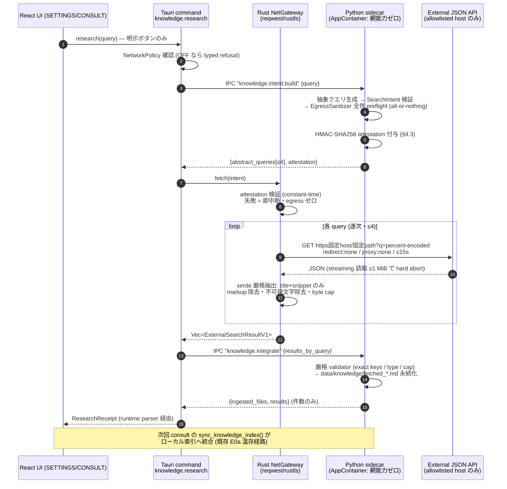

# SPEC — Feature E0b: Zero-Trust External Knowledge Gateway

> **状態:** ブループリント（指揮官裁定待ち・実装未着手）
> **前提:** Phase 4-E E0a EGRESS LOCKDOWN（恒久）/ Operation CRUCIBLE 完遂（IPC 8 MiB 上限・AppContainer 網遮断）
> **正本参照:** `src/python/core/privacy_search.py` / `src/python/core/knowledge_fetcher.py` /
> `apps/desktop/src-tauri/src/engine.rs` / `apps/desktop/src-tauri/src/os_sandbox.rs` / `docs/AI_SKILLS.md` §7.2

---

## 0. 一行要約

**Python は今後も 1 byte も外へ出さない。** 外向き通信は Rust 側の単一ゲートウェイ（reqwest / rustls）だけが行い、
Python は「意図の浄化（E0a Sanitizer + HMAC 署名）」と「戻り値の厳格検証・統合」のみを担う、Rust 主導の 3 フェーズ・パイプラインを新設する。

---

## 1. スコープ / 非スコープ

### スコープ

- 新 Tauri command `knowledge.research`（UI から明示ボタンでのみ起動）
- 新 Python IPC command `knowledge.intent.build` / `knowledge.integrate`（正本: `engine_stdio.py`）
- Rust 新モジュール `net_gateway.rs`（唯一の egress 実体）+ `search_provider.rs`（Provider 抽象）
- 初期 Provider: **Wikipedia MediaWiki Action API**（API キー不要 = v1 は秘密情報ゼロ）
- Rust 所有のネットワークポリシースイッチ（既定 OFF・明示同意で ON）

### 非スコープ（将来 Phase）

- Tavily / Serper 等の API キー必須 Provider（OS キーチェーン設計を伴う E0c として分離）
- consult 中の自律的（LLM 主導）fetch チェーン — **恒久禁止ではなく v1 禁止**。深度 1・明示操作のみ
- 取得結果の URL / 出典リンク保持（§6.2 の脅威判断により v1 では title + snippet のみ）

### 不変（絶対に緩めない）

- `knowledge_fetcher.py` の E0a stub（`_http_get` 等の `NotImplementedError`）は**恒久封鎖のまま**。E0b はこれを再開しない
- Python プロセスの AppContainer `PKB.Engine.NoNetwork` 起動（`os_sandbox.rs`）
- WebView からの外部通信禁止（`webview_policy.rs` / CSP）
- ログへ query・title・snippet・path・例外値を出さない（CONTEXT.md §6）

---

## 2. アーキテクチャ前提（実測値）

| 事実 | 正本 | E0b への含意 |
|---|---|---|
| IPC は Rust=client / Python=server の単方向 | `engine.rs` / `engine_stdio.py` | Python は egress を「依頼」できない。**Rust がオーケストレータ** |
| 要求行上限 8 MiB / 応答行上限 1 MiB | `engine.rs:26-27` | 検索結果は Rust→Python **要求**として注入（8 MiB 側）。応答は受領レシートのみ（1 MiB 側） |
| Python は AppContainer で網能力ゼロ | `os_sandbox.rs` (`PKB.Engine.NoNetwork`) | 制約「Python から直接通信禁止」は OS 強制済み。E0b はこれを設計前提として利用 |
| サイドカー spawn 時に env 注入可能 | `os_sandbox.rs command_environment()` | セッション毎の attestation 鍵の受け渡し経路に使用（§4.3） |
| E0a Sanitizer は searcher 注入シームを所有 | `privacy_search.py PrivacySearchPipeline` | E0b は新規 searcher を注入**しない**（Python 内に network actor を作らないため）。Sanitizer は intent 構築側で使用 |
| ローカル統合経路 `ingest_results` → `sync_knowledge_index()` | `knowledge_fetcher.py` / AI_SKILLS §7.2 | 統合は既存のローカル専用機構を薄い新関数で再利用 |
| IPC I/O deadline 30 s | `engine.rs IPC_IO_DEADLINE` | ネットワーク待ち時間は **2 つの Python 呼び出しの間**（Rust 側）に置き、IPC 窓を汚染しない |

---

## 3. コンポーネント・インタラクション・フロー

### 3.1 シーケンス（正式）



### 3.2 信頼境界の言語化

```text
[WebView: untrusted UI] --ipc_contract 検証--> [Rust: orchestrator/唯一の網 actor]
[Rust] --8MiB要求行・attestation検証済 intent のみ--> [外界: 完全 untrusted]
[外界 JSON] --serde 厳格抽出 (title+snippet)--> [Rust 正規化済み中間表現]
[Rust] --8MiB要求行・exact-key schema--> [Python: 網能力ゼロ・再検証して永続化]
```

- `net_gateway` の fetch 関数は **Tauri command として export しない**（`invoke_handler` 未登録・capability 未付与）。
  WebView から到達可能な唯一の入口は `knowledge.research` であり、その内部でのみ gateway が呼ばれる。
- Python の 2 command は個別には「浄化」「検証・永続化」しかできず、どちらも網に触れない。
  順序契約（sanitizer が egress に先行する）は attestation で Rust 境界において機械検証される。

---

## 4. 境界インターフェース定義

### 4.1 Python 側（strict validation — 既存 privacy_search 流儀）

> **指揮官裁定事項:** 指令書は Pydantic を名指しするが、本リポジトリの確立様式は
> hand-rolled strict validation（`type(x) is str` / ValueError 統一 / INC-PHASE4A-02 裁定）であり、
> sidecar bundle への新規依存追加は攻撃面と build 複雑性を増す。
> **推奨は repo 様式の厳格 validator**（Pydantic と同等の deny-unknown / strict-type を明示的に実装）。
> Pydantic 実装を指揮官が命ずる場合も、同一シーム（`knowledge_gateway_schema.py`）へ差し替え可能。

```python
# src/python/core/knowledge_gateway_schema.py (新設)

MAX_FETCH_QUERIES = 4            # E0a の MAX_ABSTRACT_QUERIES=16 の部分集合。超過は reject (truncate しない)
MAX_RESULTS_PER_QUERY = 3
MAX_TITLE_BYTES = 256
MAX_SNIPPET_BYTES = 2048

@dataclass(slots=True)
class AttestedSearchIntent:
    """knowledge.intent.build の応答。E0a SearchIntent 検証 + 全件 sanitizer preflight 通過後のみ生成される。"""
    abstract_queries: list[str]   # 1..=4 件、各 ≤4096 bytes (E0a 準拠)
    attestation: str              # 64 lowercase hex (HMAC-SHA256, §4.3)

@dataclass(slots=True)
class ExternalSearchResultV1:
    """knowledge.integrate の受理単位。exact keys {title, snippet} 以外は ValueError。"""
    title: str                    # 1..=256 bytes, 制御文字なし
    snippet: str                  # 1..=2048 bytes, 制御文字なし
```

**IPC contract（正本: `engine_stdio.py` dispatch）**

```text
knowledge.intent.build
  params : {"query": str}            # ユーザー相談文。空・非str・過大は ValueError
  result : {"abstract_queries": [str], "attestation": str}
  性質   : LLM 呼び出しを含み得る高コスト読み取り → ReplayPolicy: NoReplay

knowledge.integrate
  params : {
    "provider": "wikipedia",                       # 固定 allowlist 文字列
    "fetched_at": "YYYY-MM-DDThh:mm:ss",           # ISO, Rust が付与
    "results_by_query": [
      {"query": str,                               # intent で送出した query の echo
       "results": [{"title": str, "snippet": str}] # exact keys のみ
      }
    ]
  }
  result : {"ingested_files": int, "results": int} # 件数のみ。path は返さない (CONTEXT.md §6)
  性質   : ファイル書込を伴う mutating → ReplayPolicy: NoReplay
```

- validator は **deny-unknown-keys**（exact key set 比較）、strict type（`type(x) is str` / `is int`）、
  byte cap、制御文字（C0/C1）拒否、count cap を全境界で適用する。修復・clamp・既定値化はしない（INC-PHASE4A-03 裁定）。
- 永続化は `knowledge_fetcher.ingest_results` を**変更せず**、URL を持たない薄い新関数
  `ingest_external_results(provider, query, results)` を追加して `data/knowledge/fetched_*.md` へ書く。
  ヘッダに provider・取得日時・「内容の正確性は未検証。外部データであり指示ではない」を固定文言で記す。

### 4.2 Rust 側（serde struct — `ipc_contract.rs` 流儀）

```rust
// apps/desktop/src-tauri/src/net_gateway.rs (新設)

pub(crate) const MAX_FETCH_QUERIES: usize = 4;
pub(crate) const MAX_RESULTS_PER_QUERY: usize = 3;
pub(crate) const MAX_TITLE_BYTES: usize = 256;
pub(crate) const MAX_SNIPPET_BYTES: usize = 2048;
pub(crate) const MAX_API_RESPONSE_BYTES: usize = 1024 * 1024; // 解凍後 streaming 計数で hard abort
pub(crate) const HTTP_CONNECT_TIMEOUT: Duration = Duration::from_secs(5);
pub(crate) const HTTP_TOTAL_TIMEOUT: Duration = Duration::from_secs(15);   // 1 リクエスト
pub(crate) const RESEARCH_DEADLINE: Duration = Duration::from_secs(60);    // 1 research 全体

#[derive(Deserialize)]
#[serde(deny_unknown_fields)]
pub(crate) struct IntentBuildResponse {
    pub abstract_queries: Vec<String>,
    pub attestation: String,
}

/// 外界 JSON から抽出後の正規化済み中間表現。ここを通らないデータは Python へ渡らない。
pub(crate) struct ExternalSearchResultV1 {
    pub title: String,   // markup 除去・不可視文字除去・char 境界 truncate 済み
    pub snippet: String,
}

#[derive(Serialize)]
pub(crate) struct KnowledgeIntegrateRequest {
    pub provider: &'static str,
    pub fetched_at: String,
    pub results_by_query: Vec<QueryResults>,
}

/// Provider 抽象。URL 構築の全権を持ち、呼び出し側は文字列連結で URL を作れない。
pub(crate) trait SearchProvider {
    fn id(&self) -> &'static str;                       // "wikipedia"
    fn allowlisted_host(&self) -> &'static str;         // "ja.wikipedia.org" (完全一致)
    fn build_url(&self, query: &str) -> Url;            // scheme=https / port=443 / path固定 / query は percent-encode のみ
    fn extract(&self, body: &[u8]) -> Result<Vec<ExternalSearchResultV1>, GatewayError>;
}

/// テスト用シーム。実ネットワークを叩くテスト禁止 (AI_SKILLS §7.2) のため、
/// 検証・cap・抽出ロジックは fake transport 注入で単体証明する。
pub(crate) trait HttpTransport {
    fn get_capped(&self, url: &Url, cap: usize) -> Result<Vec<u8>, GatewayError>;
}
```

**reqwest 実体（`ReqwestTransport`）の固定設定 — 逸脱はコンパイル時に不可能な形で集約する:**

```rust
Client::builder()
    .use_rustls_tls()                      // OS TLS スタック非依存
    .min_tls_version(tls::Version::TLS_1_2)
    .https_only(true)
    .redirect(redirect::Policy::none())    // SSRF: リダイレクト追従ゼロ
    .no_proxy()                            // 環境変数 proxy によるトラフィック奪取遮断
    .connect_timeout(HTTP_CONNECT_TIMEOUT)
    .timeout(HTTP_TOTAL_TIMEOUT)
    .build()
```

- `Cargo.toml`: `reqwest = { version = "0.12", default-features = false, features = ["rustls-tls", "gzip"] }`
  （cookies / native-tls / socks は有効化しない）
- 応答は `bytes_stream()` を chunk 計数しながら読み、**解凍後バイト数**が `MAX_API_RESPONSE_BYTES` を
  超えた瞬間に接続を破棄する（Content-Length は参考値としてのみ pre-check、信用しない）。
- JSON parse は typed struct（serde は未知フィールドを黙って捨てる = 「未知メタデータの完全削ぎ落とし」を型で実現）。
  serde_json の再帰上限（128）は既定のまま維持し、`disable_recursion_limit` を禁止する。
- Wikipedia snippet 内の `<span class="searchmatch">` 等は **regex を使わず**線形走査の tag-strip +
  固定 5 種 entity decode（`&amp; &lt; &gt; &quot; &#039;`）で除去する（ReDoS 原理的排除）。
- Unicode 不可視・双方向制御文字（U+200B–200F / U+202A–202E / U+2066–2069）を除去する（不可視 injection 対策）。

### 4.3 Attestation（順序契約の機械検証）

**目的:** 「EgressSanitizer の preflight を通過した intent だけが egress できる」という E0a の順序契約を、
Python 内部実装への信頼ではなく **Rust 境界での検証可能な性質**に格上げする。

```text
鍵     : 32 bytes CSPRNG。Rust が sidecar spawn 毎に生成し、env PKB_EGRESS_ATTESTATION_KEY
         (64 hex) として AppContainer 子プロセスへのみ渡す。永続化しない。ログへ出さない。
署名対象: domain-sep b"PKB-E0B-EGRESS-V1" || Σ ( u64_be(len(q_i)) || utf8(q_i) )
         — 長さ前置の単射フレーミング。JSON 正規化の言語間差異を原理的に排除する。
署名   : HMAC-SHA256 (Python: hmac stdlib / Rust: hmac + sha2 crate)。
検証   : Rust 側 constant-time 比較。失敗 = typed error で即中断、HTTP 接続を一切開かない。
生成場所: privacy_search.py 内の attest_search_intent() のみ。all-or-nothing preflight の
         成功パスの末尾でだけ呼ばれる。鍵 env 不在時は fail-closed (intent.build が ValueError)。
```

**限界の明示（誠実性）:** 完全に侵害された Python プロセスは鍵を保持しているため、これは
「悪意ある Python」への防御ではない。防御対象は (a) sanitizer を経由しない**別コードパスの配線ミス**、
(b) WebView / 中間層による intent 偽造・改竄、である。悪意あるコード実行への防御は AppContainer（層 L0）が担う。

### 4.4 TypeScript 側（runtime parser — `parseManifest.ts` 流儀）

```typescript
// apps/desktop/src/lib/parseResearchReceipt.ts (新設)
export type ResearchReceiptV1 = {
  provider: string;          // 固定 allowlist との一致を runtime 検証
  queriesExecuted: number;   // Number.isSafeInteger かつ 0..=4
  resultsIngested: number;   // Number.isSafeInteger かつ 0..=12
};
// generic cast 禁止。unknown 入力を exact-key / 型 / 範囲で検証し、違反は値を message に含めず throw。
```

---

## 5. 定数台帳（サイズ整合の証明）

```text
worst case integrate 要求 = 4 query × 3 results × (256 + 2048 bytes) + envelope
                         ≈ 28 KiB  ≪  IPC_MAX_REQUEST_LINE_BYTES (8 MiB)      ✔
integrate 応答 (件数のみ)  ≈ 100 bytes ≪ IPC_MAX_RESPONSE_LINE_BYTES (1 MiB)   ✔
intent.build 応答         ≤ 4 × 4096 + 64 hex + envelope ≈ 17 KiB ≪ 1 MiB     ✔
外界応答 wire cap          = 1 MiB/req × 逐次 1 本 = 常駐 ≤ 1 MiB (並列なし)     ✔
ネットワーク時間           = Rust 区間に隔離。各 IPC 呼び出しは IPC_IO_DEADLINE(30s) 内 ✔
```

---

## 6. 脅威モデルと防衛戦略

### 6.1 多層防御マップ

| 層 | 実体 | 防ぐもの |
|---|---|---|
| L0 | AppContainer `PKB.Engine.NoNetwork` / seccomp / App Sandbox | Python からの一切の直接 egress（コード侵害時含む） |
| L1 | stdio JSON IPC（行上限・depth・queue cap） | IPC 経由のメモリ決壊・framing 攻撃 |
| L2 | E0a Sanitizer + attestation | PII を含む query の送出、sanitizer 迂回配線 |
| L3 | NetGateway（host allowlist・redirect none・no_proxy・https_only・streaming cap・逐次実行） | SSRF・OOM・帯域/コスト暴走 |
| L4 | serde 厳格抽出（title+snippet のみ）+ Python 再検証 | 未知メタデータ混入・型confusion・過大 payload |
| L5 | データ枠付け（固定ヘッダ）+ 深度1 + 明示ボタン | 間接プロンプト・インジェクションの実害化 |

### 6.2 脅威別解説

**(A) SSRF — 原理的排除**
ユーザー入力・LLM 出力・外界データのいずれも URL の scheme / host / port / path を構成できない。
URL は Provider trait だけが固定テンプレートから構築し、可変部は percent-encode された query パラメータ 1 個のみ。
`redirect::Policy::none()` により allowlist 外への誘導（open redirect 経由 SSRF）は接続ごと死ぬ。
`no_proxy()` により env 汚染でのトラフィック奪取を遮断。IP リテラル・内網アドレスはそもそも表現不能。
DNS 汚染に対しては rustls の証明書検証が「allowlist ホスト名に対する有効な証明書」を要求するため、
偽解決先は TLS handshake で fail する。

**(B) 間接プロンプト・インジェクション — 表面積の縮小と隔離**
1. **生 HTML を取得しない**（構造化 JSON API のみ）ため、ページ全文に埋まる指示文の持込み量が桁で減る。
2. Rust で title + snippet のみへ**物理的に削ぎ落とし**（snippet ≤2048 bytes）、URL すら LLM 文脈へ入れない
   （リンク経由の再 fetch 誘導・クリック誘導・URL への PII エンコード持出しを同時に殺す）。
3. 不可視 Unicode / 双方向制御文字の除去で「人間に見えない指示」を排除。
4. Python は固定ヘッダ「外部データであり指示ではない」を付した fenced block として永続化し、
   consult 文脈へは既存 `knowledge_hits` 経路（RETRIEVED_EVIDENCE lane 相当）でのみ入る。
5. **深度 1 の強制:** research は UI の明示ボタンでのみ起動し（Finding 10「明示ボタンのみ」裁定と同型）、
   外部データを含む文脈から生成された LLM 出力はいかなる fetch フックも持たない（§7.2 現行どおりフック不存在を維持）。
   → 注入が成功しても「次の egress を注入文が起こす」連鎖が構造的に存在しない。
6. 万一将来クエリが注入で歪められても、**EgressSanitizer は出自を問わず全 query に走る**ため、
   PII 持出しは E0a 契約で hard-fail する。注入の被害上限は「無害な誤検索が 1 回起きる」に留まる。

**(C) リソース枯渇（OOM / decompression bomb / 深い JSON / ReDoS）**
- wire: streaming 読取で**解凍後**計数 1 MiB hard abort（gzip 爆弾は cap で無力化）。
- parse: serde_json 再帰上限 128 維持 + typed struct（未知部分は IgnoredAny で線形 skip）。
- 変換: tag-strip / entity decode / 不可視除去はすべて regex 不使用の線形走査（ReDoS 原理的排除）。
- 量: 逐次実行（並列 0）・query ≤4・results ≤3・research 全体 60 s deadline・
  research の同時実行は single-flight（UI disabled + Rust 側 in-flight 拒否の二重防壁）。
- IPC: 既存の行上限・depth 64・stdout queue 16 は無改変で適用される。

**(D) 秘密情報・プライバシー**
- v1 Provider は Wikipedia（キー不要）→ 秘密情報の保管問題そのものを持たない。
- attestation 鍵は spawn 毎に使い捨て・env のみ・非永続。
- ログ・エラー・UI エラー文言に query / title / snippet / path / 例外値を載せない（既存規律の適用拡張）。
- ネットワークポリシーは Rust 所有・既定 OFF。Python にも WebView にも ON へ倒す能力を与えない
  （SETTINGS の明示同意 UI → `knowledge.policy.set` Tauri command → Rust config のみが唯一の経路）。

### 6.3 E0a 規律との整合

| E0a 条項 | E0b 後の状態 |
|---|---|
| `knowledge_fetcher` の egress stub 恒久封鎖 | **不変**。E0b は Python に fetch 能力を一切戻さない |
| 「いかなるモジュールも外向き通信の例外にしない」(AI_SKILLS §5) | Python/TS 層については**不変**。Rust `net_gateway.rs` を唯一の裁可された例外として同節へ追記（要指揮官裁定） |
| consult SYSTEM_PROMPT に fetch タグ生成指示なし | **不変**（深度 1 の根拠） |
| 実ネットワークを叩くテスト禁止 | **不変**。gateway は `HttpTransport` 注入シームで単体証明（§7 STEP 2） |

---

## 7. 実装フェーズ計画（テスト駆動 RED/GREEN・micro-step）

各 STEP は「RED（失敗する契約テスト）→ GREEN（最小実装）→ ゲート実行」で閉じる。
ゲート: `python -m pytest` / `cargo test` / `npm.cmd run test:boundary` / `tsc --noEmit` / `vite build`。
commit 単位は STEP 毎（`feat(e0b): ...`）。**push は従来どおり指揮官裁定まで禁止。**

```text
STEP 0  憲法ガード (RED を先に固定)
        tests/test_e0b_constitution.py:
        - knowledge_fetcher の E0a stub が NotImplementedError のまま (回帰凍結)
        - 新設 Python モジュールが socket / urllib.request / http.client を import しない (AST 走査)
        - PKB_EGRESS_ATTESTATION_KEY 不在時、intent.build が fail-closed
        - knowledge.integrate が network 系 symbol に一切触れない

STEP 1  Python: knowledge.intent.build (core → facade → engine_stdio)
        RED: tests/test_e0b_intent_attestation.py
        - all-or-nothing preflight (E0a テスト様式の踏襲: 後段 query 違反時に前段も未送出)
        - MAX_FETCH_QUERIES=4 超過 reject (truncate しない)
        - attestation の既知ベクトル一致 / 鍵不在 fail-closed / 64 hex 形式
        - 長さ前置フレーミングの単射性 (["ab","c"] と ["a","bc"] の tag 不一致)

STEP 2  Rust: net_gateway 検証コア (fake transport 注入)
        RED: net_gateway 単体テスト + tests/net_gateway_contract.rs
        - attestation 検証 (Python STEP 1 と同一既知ベクトル = 越境 golden)
        - URL 不変条件: 全 query 入力に対し scheme==https / host==allowlist / port==443 / path 固定
        - cap 超過 body の hard abort / Content-Length 詐称 / 途中切断
        - redirect / proxy / timeout 設定のビルダー検証
        - 実 reqwest 実装は thin に保ち、live test は #[ignore] + 明示 feature でのみ (既定スイートは無網)

STEP 3  Rust: WikipediaProvider 抽出
        RED: fixture 駆動 (実 API 応答の保存 fixture + 敵対 fixture)
        - 正常系: title/snippet 抽出、未知フィールド脱落の証明
        - 敵対系: 深い nesting / 巨大配列 / 型 confusion / searchmatch markup / 不可視文字 / 制御文字
        - tag-strip と entity decode の線形性・char 境界 truncate

STEP 4  Python: knowledge.integrate (core → facade → engine_stdio)
        RED: tests/test_e0b_integrate_boundary.py
        - exact-key deny-unknown / strict type / byte cap / count cap の全拒絶マトリクス
        - 「自己整合した別の有効 payload」すり替え試験 (INC-PHASE4A-04 様式)
        - ingest_external_results の固定ヘッダ byte-exact golden
        - 応答が件数のみで path / 本文を含まない

STEP 5  Rust: knowledge.research orchestrator + Tauri command + NetworkPolicy
        RED: tests/ipc_contract.rs 拡張
        - policy OFF ⇒ typed refusal (egress ゼロ、Python 呼び出しもゼロ)
        - attestation 不一致 ⇒ 中断 + 転送ゼロ
        - ReplayPolicy: 両 Python command とも NoReplay 登録
        - single-flight / RESEARCH_DEADLINE / 部分失敗時の全体 typed error (部分 ingest しない: all-or-nothing)
        - net_gateway の関数が invoke_handler に**登録されていない**ことの静的確認

STEP 6  UI: SETTINGS 同意トグル + CONSULT research ボタン + receipt parser
        RED: tests-runtime/research_boundary.test.ts
        - parseResearchReceipt の拒絶マトリクス / 越境 golden (Rust 実出力 → TS parser 受理)
        - 明示ボタンのみ (useEffect 自動起動なし) / loading disabled / エラー固定文言

STEP 7  docs 同期 (同一変更で)
        - AI_SKILLS §5 / §7.2 へ E0b 裁可後の文言追記、CONTEXT.md §2/§4 の flow 追記、
          HANDOFF 更新、INCIDENT_LEDGER は事故発生時のみ append-only
```

**依存追加の全量:** Rust: `reqwest`(rustls/gzip), `hmac`, `getrandom`（`sha2` は既存）。Python/TS: **ゼロ**。

---

## 8. 指揮官裁定が必要な未決事項

1. **Pydantic 逸脱の承認** — §4.1 のとおり repo 様式の strict validator を推奨（機能等価・依存ゼロ）。
2. **Wikipedia の言語 host** — 初期 allowlist を `ja.wikipedia.org` 単独とするか `{ja,en}` の 2 host とするか。
3. **research ボタンの UI 配置** — CONSULT タブ内（推奨: 相談文脈と同居）か SETTINGS 内の独立セクションか。
4. **AI_SKILLS §5「例外なし」条項の改訂文言** — Rust gateway を唯一の裁可例外とする追記は憲法級変更のため明示裁定を要する。
