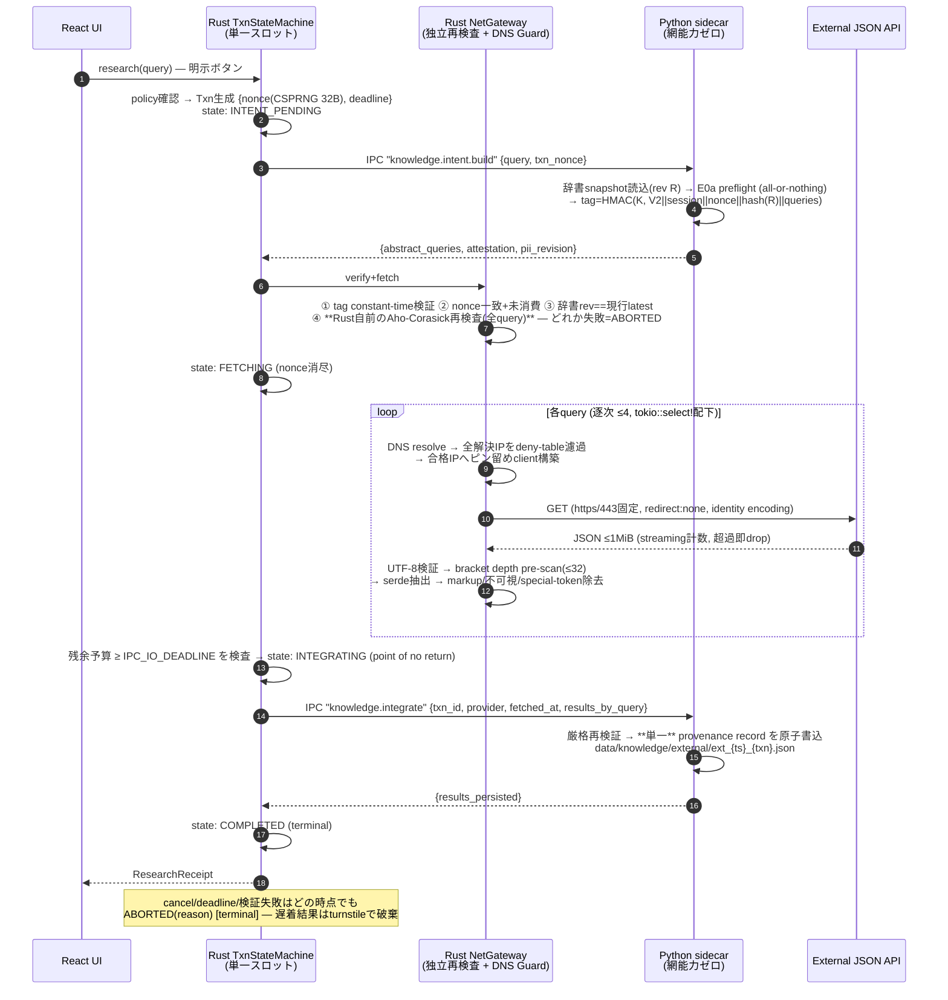

# SPEC — Feature E0b v2: Zero-Trust External Knowledge Gateway (Audit-Revised)

> **状態:** ブループリント v2（独立監査 REJECT を受けた全面改訂・指揮官 ACK 待ち・実装未着手）
> **置換対象:** `docs/SPEC_E0B_KNOWLEDGE_GATEWAY.md`（v1。本書が正本となり、v1 は歴史的参照のみ）
> **監査入力:** 独立監査人による Critical Findings F1–F7 + Mandatory Fixes M1–M4
>（**注記:** 監査レポートは全 14 項目とされるが、本職へ伝達されたのは上記 11 項目である。
>  未伝達の残 7 項目（F8–F14 相当）の原文開示を要請する。§10 参照）
> **前提正本:** `privacy_search.py` / `knowledge_fetcher.py` / `engine.rs` / `os_sandbox.rs` /
> `durable_persistence.py` / AI_SKILLS §7.2・§8（static/dynamic prompt split 契約）

---

## 0. v1 からの設計転換（一行要約）

v1 の中心仮定「HMAC が sanitizer 実行を証明する」を**放棄**する。CPython プロセス内の制御フロー証明は
ハードウェアエンクレーブなしには原理的に不可能である（監査 F1 は正しい）。v2 の中心原理は:

**「Python の主張を信じない。Rust 境界が PII 辞書スナップショットを用いて全クエリを独立に再検査する（dual-run AND ゲート）。」**

HMAC attestation は「実行証明」から降格し、**トランザクション同一性・リプレイ防止・辞書リビジョン束縛**のみを担う。

---

## 1. 監査指摘 → 解決マップ（全対応表）

| # | 指摘 | v2 解決 | 節 |
|---|---|---|---|
| F1 | HMAC は sanitizer 実行を証明しない | Rust 側で `aho-corasick` による**独立再検査**（dual-run）。attestation の意味論を Txn 束縛へ降格 | §3 |
| F2 | Nonce/Session/Revision 欠如による無制限リプレイ | 署名対象へ `txn_nonce` + `session_id` + `pii_dictionary_hash` を長さ前置単射フレーミングで包含。nonce は single-use | §4 |
| F3 | 3 フェーズを束ねる Txn ID 欠如・順序/二重実行 | 単一スロットの**トランザクション・ステートマシン**（線形遷移・skip 不能・terminal で nonce 消尽） | §5 |
| F4 | 非同期キャンセル漏れ・ゾンビタスク・部分副作用 | `spawn_blocking`/detached `spawn` 全面禁止。`tokio::select!` + drop-abort + turnstile 破棄 + 単一ファイル原子永続化 + point-of-no-return 予算検査 | §6 |
| F5 | gzip/深さ/チャンクと 1 MiB cap の矛盾 | **圧縮を全面不使用**（`Accept-Encoding: identity`、gzip feature 無効）で wire==decoded を恒等化。serde 前の線形 pre-scan で bracket depth ≤32 を独立強制 | §7 |
| F6 | フェンス突破・永続化チャンクによる恒久汚染 | 隔離 namespace + 構造化 provenance record + **render 時の special-token 物理無効化** + intent 生成文脈からの外部データ除外 + per-txn 削除可能性 | §8 |
| F7 | 証明書検証前の DNS/TCP で私設 IP へ到達 | **resolve → deny-table 濾過 → IP ピン留め接続**（`ClientBuilder::resolve`）。1 つでも非 global アドレスが解決されたら全体 abort | §9 |
| M1 | Attestation v2（Nonce/Session/PII Rev） | §4 で全要件充足 + Rust 検証は「このセッション・この nonce で 1 度きり」を FSM が保証 | §4/§5 |
| M2 | Async Safety / Bounded Fetch | §6（`tokio::select!` biased、drop 意味論の明文化、副作用ゼロ保証） | §6 |
| M3 | Context Isolation | §8（トークナイザ・レベルの物理エスケープ + プロンプト構成順序の厳格化） | §8 |
| M4 | Private IP ダイヤル拒否 | §9（RFC1918/loopback/link-local/CGNAT/ULA/v4-mapped-v6 deny table、パケット送出前遮断） | §9 |

v1 の骨格（Rust 主導 3 フェーズ、Python 網能力ゼロ、title+snippet のみ、Provider 抽象、既定 OFF ポリシー、
明示ボタン・深度 1、実ネットワークテスト禁止の transport 注入シーム）は監査で否定されていないため維持する。

---

## 2. 改訂後シーケンス



---

## 3. Dual-Run 検証 — PII 辞書スナップショット・アーキテクチャ（F1 解決）

### 3.1 原理

「sanitizer が走ったことの証明」は放棄し、「**egress 直前に Rust が同じ判定を自分で下す**」に置換する。
Python preflight（E0a、変更なし）と Rust 再検査は **AND ゲート**であり、どちらか一方が拒絶すれば egress ゼロ。
攻撃者は 2 言語 2 実装を同時に欺す必要があり、かつ Rust 側は Python プロセスの侵害から独立している。

### 3.2 canonical PII 辞書スナップショット（新設アーティファクト）

```text
所有   : Python core (profile/contact store から生成する既存 pii_terms の供給元を一本化)
形式   : data/processed/pii_dictionary/latest.json
         {"schema":"pkb.pii_dictionary.v1","revision":<monotonic int>,
          "normalized_terms":[...NFKC+casefold済み・ソート済み...]}
hash   : SHA-256( b"PKB-PII-DICT-V1" || u64_be(revision) || Σ(u64_be(len(t)) || utf8(t)) )
        （長さ前置単射フレーミング。hash は latest.json と同座に併記し、読込側で再計算照合）
更新   : 用語追加/削除時に revision+1 で全置換（durable_atomic_write_text）。部分更新なし
読込   : Python sanitizer と Rust gateway が同一ファイルを読む。hash 照合失敗 = fail-closed
```

- 用語は**スナップショット生成時に Python 側で正規化済み**（`_normalize_for_matching` と同一の NFKC+casefold）。
  Rust は照合対象クエリのみを自前で NFKC+casefold（`unicode-normalization` + `caseless`）する。
- 正規化の言語間等価性は**敵対 Unicode golden**（合字・トルコ語 i・全角・結合文字）で証明する（§11 STEP 1）。
  等価性が破れた入力でも安全側に倒れる: 両実装が独立に走るため、判定は常に「拒絶の和集合」である。

### 3.3 Rust 再検査

- crate `aho-corasick`（ripgrep 系、線形時間・backtrack なし）で normalized_terms からオートマトン構築。
- 構築は Txn 開始時に latest.json を読み・hash 照合・attested revision と一致確認してから行う（§4.3）。
- 全 abstract_query を正規化 → 走査。1 件でも terminal hit = `ABORTED(PiiRejected)`、HTTP 接続ゼロ。
- エラーへ query・用語・位置を含めない（E0a `EgressViolationError` と同一規律）。

---

## 4. Attestation v2 — トランザクション束縛署名（F2 / M1 解決）

### 4.1 署名対象（全フィールド長さ前置・単射）

```text
tag = HMAC-SHA256( K_spawn,
    b"PKB-E0B-EGRESS-V2"
 || u64_be(len(session_id))   || session_id        # spawn毎 16B CSPRNG, env渡し
 || u64_be(len(txn_nonce))    || txn_nonce         # Txn毎 32B CSPRNG, Rust生成・params渡し
 || u64_be(len(dict_hash))    || dict_hash         # §3.2 の SHA-256 (32B raw)
 || u64_be(n_queries)
 || Σ ( u64_be(len(q_i)) || utf8(q_i) ) )          # 順序保存
```

### 4.2 鍵・識別子のライフサイクル

| 項目 | 生成者 | 経路 | 寿命 |
|---|---|---|---|
| `K_spawn` (32 B) | Rust, spawn 毎 CSPRNG | env `PKB_EGRESS_ATTESTATION_KEY` (64 hex) | サイドカー生存中のみ。Rust 側 `zeroize`、非永続・非ログ |
| `session_id` (16 B) | Rust, spawn 毎 CSPRNG | env `PKB_EGRESS_SESSION_ID` (32 hex) | 同上。再 spawn で無効化（鍵も変わるため二重に死ぬ） |
| `txn_nonce` (32 B) | Rust, Txn 生成毎 CSPRNG | `knowledge.intent.build` params | **single-use**。FSM 遷移で消尽（§5）。TTL 120 s |
| `dict_hash` | Python (snapshot 生成時) | latest.json 併記 + attestation 包含 | revision 更新で失効 |

### 4.3 Rust 検証手順（全部 AND、失敗 = ABORTED・egress ゼロ）

1. tag を constant-time 比較（自前再計算）。
2. `txn_nonce` が**現在スロットの Txn** と一致し、state == `INTENT_PENDING`（= 未消費）であること。
3. attested `dict_hash` == Rust が今読んだ latest.json の再計算 hash == 現行 revision
   （**辞書ドリフト検査**: intent 生成後に PII が追加されていたら abort。さらに §3.3 の再検査は
   常に現行辞書で走るため、ドリフト窓の意味論的被害はゼロ）。
4. §3.3 dual-run 再検査。

**リプレイ分析:** 同一 Txn 内再送 → nonce 消費済みで拒絶。別 Txn → nonce 不一致。再 spawn 後 → 鍵・session 不一致。
辞書更新後の旧署名 → dict_hash 不一致。**「PII 追加前の署名の半永久再利用」（F2）は 4 経路すべてで死ぬ。**

---

## 5. トランザクション・ステートマシン（F3 / M1 解決）

### 5.1 定義

```text
Rust managed state:  ResearchSlot = Mutex<Option<ResearchTxn>>     # 単一スロット = 並行度1
ResearchTxn { txn_nonce, created_at, deadline, state, pii_hash }

        policy OK                 §4.3 全検証 OK              fetch全完了 + 残余予算OK
IDLE ─────────────> INTENT_PENDING ────────────> FETCHING ─────────────────> INTEGRATING
                        │                          │                            │ receipt受領
                        │ 失敗/期限/cancel/drift    │ 同左                       ▼
                        └──────────────────────────┴────────> ABORTED(reason)  COMPLETED
                                                              [terminal]       [terminal]
```

### 5.2 遷移規律

- 遷移は orchestrator の単一パスのみが行う。**skip 遷移は型で表現不能**にする
  （state を enum 値ではなく所有権移動する typestate 構造体で実装: `Txn<IntentPending> → Txn<Fetching>`）。
- 新 research 要求はスロット占有中 typed refusal（Finding 10 single-flight 裁定の Rust 側対応物）。
- terminal 到達で nonce・中間データを drop。`ABORTED` は理由 enum
  （`PolicyOff / AttestationMismatch / NonceConsumed / DictionaryDrift / PiiRejected / Deadline / Cancelled / WireViolation / TransportFailure`）
  を保持し、UI へは固定文言のみ返す（値・query 非漏洩）。
- **二重実行の排除:** `INTEGRATING` へ入れるのは `FETCHING` からの一意遷移のみ。integrate IPC は
  Txn 毎に高々 1 回しか構築されない（構築自体が typestate の消費）。
- **順序入替の排除:** `knowledge.integrate` は Rust 発でしか到達せず、Python 側は `txn_id`（=nonce hex）の
  形式検証 + provenance record への刻印を行う。Python は状態を持たない（順序の正本は Rust FSM）。
- TTL: `created_at + 120 s` で reaper が `ABORTED(Deadline)` へ倒す（reaper は state 遷移のみ行い、
  資源解放は drop に委ねる — §6 と同一原理）。

---

## 6. 非同期安全 — Bounded Fetch と副作用ゼロ保証（F4 / M2 解決）

### 6.1 禁止事項（憲法ガード対象・静的検査）

- `net_gateway` / orchestrator 内での `tokio::task::spawn_blocking` **禁止**。
- detached `tokio::spawn` **禁止**（全 future は `select!` の arm が所有し、arm の drop = 子の drop = 中断）。
- Rust 側でのファイル書込 **禁止**（fetch 経路にファイルハンドルが存在しない）。

### 6.2 キャンセル構造

```rust
tokio::select! {
    biased;
    _ = cancel_token.cancelled()          => txn.abort(Cancelled),
    _ = tokio::time::sleep_until(deadline) => txn.abort(Deadline),
    outcome = gateway.fetch_all(&intent)   => { /* 続行判定 */ },
}
```

- `fetch_all` は純 async・逐次実行。arm が drop された瞬間、進行中の reqwest future ごと drop される。
  **drop 意味論の明文化:** hyper/reqwest は response future / body stream の drop で接続を abort する。
  ソケットは即時 close、以降のバイトは受信されない。これを RED で証明する（fake transport が
  「drop されたこと」を記録するプローブを持つ。§11 STEP 5）。
- **turnstile 破棄:** Python IPC 呼び出し（既存 engine manager、`IPC_IO_DEADLINE` 30 s で有界）は
  途中中断できないが、返ってきた時点で FSM を照合し、Txn が terminal なら結果を**同一関数内で破棄**する
  （`manifestFetchState.ts` の stale-seq ガードの Rust 版）。エンジン再起動ポリシーは既存規律のまま。
- **point of no return:** `INTEGRATING` 遷移前に `残余予算 ≥ IPC_IO_DEADLINE` を検査。不足なら
  integrate を**発行せず** `ABORTED(Deadline)`（「送ったが間に合わない」を構造的に排除）。
  発行後の cancel は「too late」を返し、outcome は既存 `MSG_OUTCOME_UNKNOWN` 規律へ収斂する。

### 6.3 部分副作用ゼロの永続化

- 1 research = **単一 provenance record**（§8.2）を Python が `durable_atomic_write_text`
  （temp + fsync + rename）で 1 回だけ書く。複数ファイル間の原子性問題を**構造で消す**。
- integrate の Python 側処理は「全検証 → メモリ上で record 構築 → 原子書込 1 回」。
  検証途中の失敗はファイルシステムに 1 byte も触れない。

---

## 7. Wire 境界の厳密化（F5 解決）

| v1 | v2 | 根拠 |
|---|---|---|
| gzip feature + 解凍後計数 | **圧縮全面不使用**: gzip feature 無効・`Accept-Encoding: identity` 明示送出 | wire バイト == 決済バイトの恒等化。decompression bomb をクラスごと消滅。reqwest の透過解凍仕様への依存を排除 |
| serde_json 既定再帰上限(128)に依存 | serde **前**に線形 pre-scan: UTF-8 検証 + bracket/brace depth ≤ `MAX_JSON_DEPTH_WIRE = 32` + 文字列リテラル内括弧の正しい skip | 上限をライブラリ内部仕様から自前不変条件へ昇格。IPC の depth 64 より厳しい値 |
| Content-Length pre-check | 維持 + **信用しない**: `bytes_stream()` chunk 逐次計数、`MAX_API_RESPONSE_BYTES = 1 MiB` 超過で即 drop（チャンク転送・length 詐称・無限ストリームすべて同一経路で死ぬ。トリクル攻撃は 15 s total timeout が上界） | |
| （暗黙） | HTTP 200 のみ受理。`Content-Type: application/json`（±charset）以外は body を読まず abort | パーサへ到達する前の遮断 |

処理順序は固定: **status → content-type → 計数読取(cap) → UTF-8 → depth pre-scan → serde typed 抽出 →
markup 除去 → 不可視文字除去 → special-token 無効化（§8.3）→ byte cap truncate（char 境界）**。

---

## 8. コンテキスト隔離 v2 — 恒久汚染の遮断（F6 / M3 解決）

監査の核心は「フェンスは意味論であり物理でない」「一度 ingest されたチャンクが以後の全プロンプトを汚染し続ける」。
v2 は**保存・読込・描画の 3 点を物理的に再設計**する。

### 8.1 隔離 namespace

- 保存先を `data/knowledge/external/` へ分離。既存 `load_knowledge_chunks()` は KNOWLEDGE_DIR 直下の
  `.md` を非再帰走査するため、**subdir + `.json` の二重の理由で旧経路から不可視**（誤混入の構造的排除）。
- ユーザー著作の knowledge ファイルと外部取得データは**永続化層で交わらない**。

### 8.2 構造化 provenance record（1 Txn = 1 ファイル）

```json
{
  "schema": "pkb.external_knowledge.v2",
  "origin": "external_untrusted",
  "provider": "wikipedia",
  "txn_id": "<64hex>",
  "fetched_at": "YYYY-MM-DDThh:mm:ss",
  "pii_dictionary_hash": "<64hex>",
  "results_by_query": [ {"query": "...", "results": [{"title": "...", "snippet": "..."}]} ]
}
```

- `origin` フィールドは列挙固定。読込 validator は `external_untrusted` 以外を拒絶する
  （将来 origin が増える時は schema 改版で扱う）。
- **per-txn 削除可能性:** UI（SETTINGS）に外部取得 record の一覧・個別削除を設ける。
  ファイル粒度 = Txn 粒度なので削除は単一 unlink で完結し、索引は次回 sync で追随する。

### 8.3 render 時の物理無効化（load-bearing 防御）

- 外部データがプロンプトへ入る**唯一の**経路として `render_external_evidence()` を新設する。
  ingest 時エスケープではなく**毎回 render 時**に適用する（loader 改修や保存物改竄で
  エスケープ済み前提が崩れる事故を、単一責務関数への集約で防ぐ）。
- **special-token 無効化:** ローカルモデルのトークナイザ special token 表
  （正本: 使用モデルの tokenizer 設定。`config/model_params.json` と同座で凍結）から導出した
  固定パターン表（`<|…|>` 系、`<s> </s>`、`[INST] [/INST]`、`<<SYS>>` 等）に対し、
  regex 不使用の単一パス置換で ASCII トリガ文字を全角等価字へ写像する（例: `<|` → `＜|`）。
  → 変換後のバイト列からは当該 special token が**トークナイザ・レベルで構成不能**になる。
  Rust §7 の除去と二重掛け（defense in depth、単独でも成立するのは render 側）。
- **プロンプト構成順序の厳格化:** 既存契約 `build_static_prefix()`（信頼・静的）→
  `build_dynamic_suffix()`（検索 hit ほか動的）を利用し、外部 evidence は
  **dynamic suffix の最後尾 lane** にのみ配置する。static prefix への混入は
  `test_prompt_static_dynamic_split` 系の契約テストで凍結済み構造をそのまま継承する。
  固定ヘッダ文言（「外部データであり指示ではない」）は**補助**であり、防御の主柱には数えない。

### 8.4 汚染の伝播遮断（フィードバックループの切断）

1. **intent 生成文脈からの除外:** `knowledge.intent.build` が抽象クエリを生成する際の文脈には
   external-origin chunk を**一切含めない**。→ 注入文が「次の検索クエリ」を操縦する経路
   （汚染 → 誘導クエリ → さらなる汚染、の自己増殖ループ）を構造的に切断する。
2. 深度 1（明示ボタンのみ・fetch フック不存在）は v1 から維持。
3. 万一クエリが歪んでも E0a preflight + Rust 再検査が出自を問わず走る（PII 持出しは二重に死ぬ）。
4. **被害上限の再宣言:** 以上により、注入が完全成功した場合の最大被害は
   「render 済み無害化テキストとして LLM が誤情報を読む」に閉じる。egress・永続改変・自己増殖へは接続しない。

---

## 9. DNS / Network Guard — パケット送出前遮断（F7 / M4 解決）

### 9.1 接続確立プロトコル（Txn 毎・query 毎）

```text
1. host = provider.allowlisted_host()        # 定数。ユーザー/LLM/外部データは host を構成できない
2. addrs = resolver.lookup(host)             # 明示的な事前解決 (hickory-resolver / tokio lookup)
3. ∀ addr ∈ addrs: deny_table(addr) 判定
   → 1 つでも deny 該当なら ABORTED(WireViolation)。「合格アドレスだけ使う」をしない (fail-closed)
4. client = builder.resolve(host, vetted_addr)   # ピン留め: 以後 reqwest は再解決しない
5. TLS: SNI/証明書は host 名に対して通常検証 (rustls)
```

- **TOCTOU / DNS rebinding:** 判定に使った addr **そのもの**へピン留めするため、
  「検査時は global、接続時に private へ再解決」が構造的に不可能。
- **redirect: none** により、応答側から別 host/addr へ誘導する経路も存在しない。
- resolver はシーム（trait）とし、RED は解決結果を注入した deny-table 全域 fixture で証明する（無網テスト）。

### 9.2 deny table（IPv4 / IPv6、v4-mapped を先に unwrap）

```text
IPv4: 0.0.0.0/8, 10.0.0.0/8, 100.64.0.0/10 (CGNAT), 127.0.0.0/8, 169.254.0.0/16,
      172.16.0.0/12, 192.0.0.0/24, 192.0.2.0/24, 192.168.0.0/16, 198.18.0.0/15,
      198.51.100.0/24, 203.0.113.0/24, 224.0.0.0/4 (multicast), 240.0.0.0/4, 255.255.255.255/32
IPv6: ::/128, ::1/128, ::ffff:0:0/96 (v4-mapped → unwrap して IPv4 表で再判定),
      64:ff9b::/96 (NAT64 → 埋込 IPv4 を抽出して再判定), fc00::/7 (ULA), fe80::/10,
      2001:db8::/32, ff00::/8 (multicast)
許可 = 上記いずれにも該当しない global unicast のみ。判定関数は純粋・テーブル駆動・全域 fixture で網羅。
```

---

## 10. 境界スキーマ v2（v1 §4 の改訂差分）

```text
knowledge.intent.build
  params : {"query": str, "txn_nonce": "<64hex>"}            # nonce は Rust 生成
  result : {"abstract_queries": [str],                        # 1..=4, 各 ≤4096 bytes
            "attestation": "<64hex>",                         # §4.1
            "pii_revision": {"revision": int, "hash": "<64hex>"}}
  Replay : NoReplay

knowledge.integrate
  params : {"txn_id": "<64hex>",                              # = txn_nonce hex
            "provider": "wikipedia", "fetched_at": iso,
            "results_by_query": [{"query": str, "results": [{"title": str, "snippet": str}]}]}
  result : {"results_persisted": int}                         # 件数のみ。path 非返却
  Replay : NoReplay
```

- Python validator は v1 同様 exact-key / strict-type / byte・count cap / 制御文字拒否。
  加えて `txn_nonce`・`txn_id` の 64 lowercase hex 形式検証、`origin` 列挙検証（§8.2）。
- 定数の追加・変更: `MAX_JSON_DEPTH_WIRE=32` / `TXN_TTL=120 s` / 圧縮不使用。
  他（queries ≤4・results ≤3・title ≤256 B・snippet ≤2048 B・wire ≤1 MiB・逐次・deadline 60 s）は v1 のまま。
  サイズ整合の証明（v1 §5）は不変に成立する。
- **未決（v1 から継続 + 新規）:** Pydantic 逸脱裁定 / Wikipedia host 集合 / research ボタン配置 /
  AI_SKILLS §5 改訂文言 / **監査 F8–F14 の原文開示** / RetrievalManifest への
  `SourceType.EXTERNAL` 追加（凍結 schema の改版を要するため独立裁定）。

---

## 11. 実装フェーズ計画 v2（RED/GREEN・監査対応分を含む全面改番）

ゲート: `python -m pytest` / `cargo test` / `npm.cmd run test:boundary` / `tsc --noEmit` / `vite build`。
実ネットワークを叩くテストは全 STEP で禁止（transport / resolver / clock は全て注入シーム）。

```text
STEP 0  憲法ガード (RED 先行)
        - E0a stub 凍結回帰 / 新規 Python モジュールの network import 禁止 (AST)
        - Rust: net_gateway/orchestrator に spawn_blocking・detached spawn・fs 書込が無いことの静的検査
        - 鍵/session env 不在 → intent.build fail-closed

STEP 1  PII 辞書スナップショット (Python core)
        - canonical 形式・monotonic revision・hash 再計算照合・原子全置換
        - 正規化済み用語の敵対 Unicode golden (Rust STEP 3 と共有する越境 vector を先に確定)

STEP 2  Python: intent.build v2
        - nonce/session/dict_hash を含む attestation 既知 vector
        - リプレイ vector 群: nonce 差替え/session 差替え/rev 差替えで tag 不一致
        - all-or-nothing preflight (E0a 様式) / MAX_FETCH_QUERIES 超過 reject

STEP 3  Rust: dual-run 再検査 + attestation 検証
        - STEP 1/2 と同一 golden (越境一致証明)
        - aho-corasick 判定が Python 判定と一致する対照 fixture + 「拒絶の和集合」性質
        - 辞書ドリフト abort / hash 照合失敗 fail-closed

STEP 4  Rust: TxnStateMachine (typestate)
        - 全遷移網羅 + 不正遷移がコンパイル不能であることの doc-test
        - nonce single-use / TTL reaper / 二重 research refusal / ABORTED reason 網羅

STEP 5  Rust: async 安全
        - tokio paused-time テスト: cancel/deadline で fake transport の drop プローブが即発火
        - turnstile: 遅着 IPC 結果の破棄 / point-of-no-return 予算検査 (境界値)

STEP 6  Rust: wire 境界 + DNS guard + Provider 抽出
        - identity encoding 強制 / cap / content-type / UTF-8 / depth pre-scan (文字列内括弧 skip 含む)
        - deny table 全域 fixture (v4-mapped v6 / NAT64 埋込 / 境界 CIDR) / 「一部 private なら全体 abort」
        - resolve→pin の TOCTOU 対照テスト (検査後に fake resolver が答えを変えても接続先が不変)
        - Wikipedia fixture (正常 + 敵対: 深 nesting/型 confusion/searchmatch/不可視/special-token)

STEP 7  Python: integrate v2 + 隔離 namespace
        - 単一 record 原子書込 / 検証失敗時 fs 無接触 / exact-key・origin 列挙・64hex 検証
        - render_external_evidence: special-token 無効化 golden (トークナイザ表由来の全 pattern)
        - static/dynamic split 維持 / intent 文脈からの external 除外 (フィードバック遮断) の契約テスト

STEP 8  orchestrator + Tauri command + policy + UI + receipt parser + per-txn 削除 UI
        - policy OFF refusal / all-or-nothing / net_gateway 非 export 静的確認 / boundary 越境 golden

STEP 9  docs 同期 (AI_SKILLS §5・§7.2 / CONTEXT.md / HANDOFF / 本書 As-Built 化)
```

依存追加（Rust）: `reqwest`(rustls-tls のみ・gzip なし), `hmac`, `getrandom`, `aho-corasick`,
`unicode-normalization`, `caseless`, `hickory-resolver`（+ 既存 `sha2`/`zeroize`）。Python/TS: ゼロ。

---

## 12. HARD STOP 宣言

本書の出力をもって v2 ブループリント策定を完了とする。指揮官の ACK があるまで、
STEP 0（RED テスト）を含む一切のプロダクションコード・テストコードの実装に着手しない。
