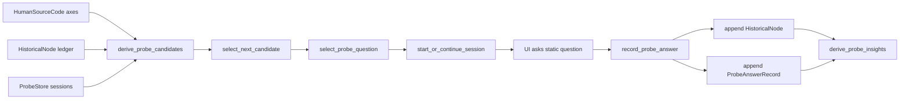

# SPEC Phase D2 PROBE Funnel

Target Delta Phase D2 defines the deterministic PROBE funnel that consumes D1
outputs (`HumanSourceCode` and append-only `HistoricalNode`) and selects the next
self-inquiry question. This document is an implementation contract for Composer.

This phase does **not** perform personality inference with an LLM. It only uses
D1 physical quantities (`score`, `confidence`, evidence counts, dates, and
append-only ledger state) plus fixed thresholds and ordered tables.

## 1. Architecture And Data Flow

### 1.1 Components

`core.probe_engine` owns the PROBE funnel state machine and store-level
operations.

Inputs:
- `core.source_code.HumanSourceCode`: five personal axes from D1.
- `core.probe_engine.HistoricalNode`: append-only factual/self-report ledger.
- `ProbeStore`: persisted D2 state from `data/processed/probe_store.json`.
- `today: str`: caller-supplied local ISO date. Never call `date.today()` inside
  core logic.
- `third_party_aliases: dict[str, str]`: optional in-memory exact replacement
  map, e.g. `{"山田太郎": "C-a1b2c3d4"}`. This map must not be persisted.

Outputs:
- `ProbeCandidate`: deterministic explanation of which axis should be probed.
- `ProbeQuestion`: static-bank question selected for the candidate.
- `ProbeSession`: active funnel session.
- New `HistoricalNode` entries for answers, appended only.
- `ProbeInsight`: machine-readable, non-LLM insight records used by UI and later
  D3/F6 phases.

Persistence:
- Store only under `core.paths.DATA_PROCESSED / "probe_store.json"`.
- Read/write with `encoding="utf-8"`.
- Writes must be atomic: write temp JSON in the same directory, then
  `os.replace`.
- Do not write to literal `"data/..."` paths.

### 1.2 Data Flow



Important separation:
- PROBE question selection may read D1 scores/confidence, but selected question
  text must come only from `PROBE_QUESTION_BANK`.
- Question text must not include `EvidenceRef.quote`, Bounty details, LINE raw
  text, or third-party names.
- PROBE answers are user-authored self-report. Storing them is not "emotion
  inference"; deriving an emotional label from them is forbidden in D2.

### 1.3 Axis Scope

D2 targets only the five personal axes:

```python
PROBE_AXIS_ORDER = (
    "decision_threshold",
    "reward_bias",
    "locus_of_control",
    "unlearning_rate",
    "friction_energy_ledger",
)
```

Interpersonal axes (`friction_response`, `latency_asymmetry`,
`protocol_plasticity`) are excluded from direct PROBE targeting in D2. They may
inform future D3/Puppeteer routing, but D2 must not ask questions that expose a
specific third party or LINE-derived conclusion.

## 2. Data Structures

Composer must implement these dataclasses in `core.probe_engine`. JSON
serialization must be explicit (`to_dict` / `from_dict`) and stable.

```python
from dataclasses import dataclass, field

STAGE_ORDER = ("FACT", "CONTEXT", "EMOTION", "MEANING")
SESSION_STATUS = ("active", "closed")

@dataclass(frozen=True)
class ProbeQuestion:
    id: str                    # "pq-<axis>-<stage>-NN"
    axis: str                  # one of PROBE_AXIS_ORDER
    stage: str                 # one of STAGE_ORDER
    text: str                  # static text only; no runtime evidence injection
    tags: tuple[str, ...] = ()

@dataclass
class ProbeCandidate:
    axis: str
    stage: str
    priority: float            # 0.0-1.0, deterministic formula below
    confidence: float
    score: float | None
    node_count: int
    open_session_id: str | None = None
    reasons: list[str] = field(default_factory=list)

@dataclass(frozen=True)
class ProbeAnswerRecord:
    session_id: str
    question_id: str
    stage: str
    node_id: str
    date: str                  # caller-supplied local ISO date
    text_quote: str            # sanitized, max 120 chars
    subjective_weight: float   # FACT/CONTEXT=0.0, EMOTION/MEANING=1.0

@dataclass
class ProbeSession:
    id: str                    # "ps-<blake2b short>"
    date: str                  # session start date
    stage: str
    target_axis: str
    questions_asked: list[str] = field(default_factory=list)
    nodes_created: list[str] = field(default_factory=list)
    status: str = "active"

@dataclass(frozen=True)
class ProbeInsight:
    id: str                    # "pi-<blake2b short>"
    kind: str                  # "low_confidence" | "under_probed" | "stage_complete"
    axis: str
    stage: str
    priority: float
    node_refs: list[str]
    evidence_refs: list[str]   # EvidenceRef indices or node ids; no raw long text
    message_code: str          # UI maps code to localized text

@dataclass
class ProbeStore:
    schema: str = "probe_store.v1"
    historical_nodes: list[HistoricalNode] = field(default_factory=list)
    sessions: list[ProbeSession] = field(default_factory=list)
    answers: list[ProbeAnswerRecord] = field(default_factory=list)
    insights: list[ProbeInsight] = field(default_factory=list)
```

`HistoricalNode` remains the D1 append-only model:

```python
@dataclass(frozen=True)
class HistoricalNode:
    id: str
    date_range: str
    fact_text: str
    source: str                # "probe" | "diary" | "import"
    is_trusted: bool = True
    superseded_by: str | None = None
    weight: float = 1.0
    disputed_with: str | None = None
```

D2 must never expose APIs named `edit_historical_node`,
`update_historical_node`, `delete_historical_node`, `remove_historical_node`, or
similar mutating/deleting verbs. Corrections use D1
`supersede_historical_node()` only.

## 3. Core Logic And Formulas

### 3.1 Sanitization

All text copied into `ProbeAnswerRecord.text_quote`, `ProbeInsight`, and
question/result JSON must pass:

```python
def sanitize_probe_text(text: str, third_party_aliases: dict[str, str]) -> str:
    out = text.replace("\n", " ").strip()
    for real_name, alias in sorted(third_party_aliases.items()):
        out = out.replace(real_name, alias)
    return out[:120]
```

Rules:
- Exact replacement only. Do not attempt named-entity recognition.
- Unknown names cannot be guessed; the caller may supply more aliases.
- Persist sanitized text in D2 records. Full raw answer text must not be logged.

### 3.2 Candidate Derivation

For each axis in `PROBE_AXIS_ORDER`, read:
- `score`: `Axis.score`; may be `None`.
- `confidence`: `Axis.confidence`, clamped to `[0, 1]`.
- `axis_nodes`: trusted, non-superseded probe nodes associated with the axis.

Node association is explicit only:
- `ProbeSession.target_axis == axis`
- `HistoricalNode.id in ProbeSession.nodes_created`

Do not infer node-axis association from free text.

Coverage:

```python
node_count = count(trusted non-superseded nodes for axis)
coverage = min(1.0, node_count / 4.0)
coverage_gap = 1.0 - coverage
```

Extremity:

```python
extremity = 0.0 if score is None else abs(score - 0.5) * 2.0
```

Priority:

```python
priority = clamp01(
    0.60 * (1.0 - confidence)
  + 0.25 * coverage_gap
  + 0.15 * extremity
)
```

Rounding:
- Store `priority = round(priority, 3)`.
- Never convert `score=None` to `0.0`.

Candidate stage:

```python
stage = first stage in STAGE_ORDER not completed for axis
if all stages completed: stage = "MEANING"
```

A stage is completed for an axis if the store has at least one
`ProbeAnswerRecord` with the same axis session and that stage, and the linked
node is trusted and not superseded.

Sorting:

```python
candidates.sort(key=lambda c: (
    -c.priority,
    PROBE_AXIS_ORDER.index(c.axis),
    STAGE_ORDER.index(c.stage),
))
```

The first candidate is the next target. This makes ties stable and testable.

### 3.3 Question Selection

Question bank is a static constant in `core.probe_engine`:

```python
PROBE_QUESTION_BANK = (
    ProbeQuestion("pq-decision_threshold-FACT-01", "decision_threshold", "FACT",
                  "直近で先延ばししたタスクを一つ、事実だけで書いてください。"),
    ProbeQuestion("pq-decision_threshold-CONTEXT-01", "decision_threshold", "CONTEXT",
                  "そのタスクを始める前に、何を確認しようとしていましたか。"),
    ProbeQuestion("pq-decision_threshold-EMOTION-01", "decision_threshold", "EMOTION",
                  "その時点で自分が書ける感覚を、本人の言葉で書いてください。"),
    ProbeQuestion("pq-decision_threshold-MEANING-01", "decision_threshold", "MEANING",
                  "いま振り返ると、その先延ばしは何を守ろうとしていましたか。"),
    # Same 4-stage coverage for every PROBE_AXIS_ORDER axis.
)
```

Selection:

```python
eligible = [q for q in PROBE_QUESTION_BANK
            if q.axis == candidate.axis and q.stage == candidate.stage]
unused = [q for q in eligible if q.id not in active_session.questions_asked]
question = unused[0] if unused else eligible[0]
```

Constraints:
- No LLM rewrite.
- No interpolation of evidence quote or HistoricalNode fact text.
- No random rotation.
- Bank order is source order.

### 3.4 Session State Machine

Starting:

```python
def probe_next_question(sc, store, today, third_party_aliases=None) -> dict:
    candidate = select_next_candidate(sc, store)
    session = find_active_session(candidate.axis) or start_session(candidate, today)
    question = select_probe_question(candidate, session)
    return {
        "schema": "probe_question.v1",
        "session_id": session.id,
        "question_id": question.id,
        "axis": candidate.axis,
        "stage": candidate.stage,
        "question": question.text,
        "priority": candidate.priority,
    }
```

Session id:

```python
id = "ps-" + blake2b(f"{today}\0{axis}\0{stage}\0{len(store.sessions)}",
                     digest_size=6).hexdigest()
```

Answering:

```python
def record_probe_answer(store, session_id, question_id, answer_text, today,
                        date_range=None, third_party_aliases=None) -> ProbeStore:
    session = active session by id
    question_id must be the next selected question for the session
    sanitized = sanitize_probe_text(answer_text, third_party_aliases or {})
    node = create_historical_node(
        date_range=date_range or today,
        fact_text=sanitized,
        source="probe",
    )
    append node
    append ProbeAnswerRecord(...)
    append node.id to session.nodes_created
    append question_id to session.questions_asked
    advance stage
```

Stage advancement:

```python
FACT -> CONTEXT -> EMOTION -> MEANING -> closed
```

Rules:
- Reverse transitions are invalid.
- Skipping to a later stage is invalid except when the current stage is already
  completed by a trusted, non-superseded node.
- One session may ask at most 5 questions. D2 bank uses 4 stage questions; the
  cap remains a guardrail.
- One active session per axis.
- One session start per `today`. If a session already exists for `today`, return
  its next question instead of starting another.

Subjective corpus weight:

```python
subjective_weight = 1.0 if stage in ("EMOTION", "MEANING") else 0.0
```

This is metadata for later D1 recomputation. D2 must not inject FACT/CONTEXT
answers into subjective analysis.

### 3.5 Insight Derivation

`derive_probe_insights(sc, store) -> list[ProbeInsight]` is deterministic and
non-linguistic. It creates records only from candidate metrics.

Rules:
- If `confidence < 0.5`, emit `kind="low_confidence"`.
- If `coverage < 0.5`, emit `kind="under_probed"`.
- If all four stages are completed for an axis, emit `kind="stage_complete"`.
- `message_code` must be one of fixed constants:
  - `probe.low_confidence`
  - `probe.under_probed`
  - `probe.stage_complete`

Priority for each insight equals the candidate priority for its axis. Insight id:

```python
id = "pi-" + blake2b(f"{kind}\0{axis}\0{stage}\0{priority}",
                     digest_size=6).hexdigest()
```

No prose generation in core. UI may map `message_code` to static copy.

## 4. Mandatory RED/GREEN Tests For Composer

Implement these in `tests/test_probe_engine.py`. Tests must run under
`tests/conftest.py` sandbox only. No real `data/` writes. No `if __name__ ==
"__main__"` blocks.

### 4.1 `test_probe_candidate_deterministic`

Given the same `HumanSourceCode`, empty `ProbeStore`, and `today`, call
`derive_probe_candidates()` and `probe_next_question()` twice.

Assert:
- Candidate lists are byte-identical after `to_dict`.
- Returned `session_id`, `question_id`, `axis`, `stage`, and `priority` match.
- No runtime clock or randomness changes output.

### 4.2 `test_probe_priority_boundary_and_tiebreak`

Fixture:
- `decision_threshold.confidence = 0.5`
- `reward_bias.confidence = 0.5`
- all other axes have confidence higher than `0.5`
- no nodes exist for either tied axis

Assert:
- Both tied axes compute the same priority.
- Selected axis is `decision_threshold` because it appears earlier in
  `PROBE_AXIS_ORDER`.
- `score=None` on any axis does not become `0.0`; extremity contribution is
  exactly `0.0`.

### 4.3 `test_probe_stage_monotonic_and_session_cap`

Start a session and answer through all stages.

Assert:
- Stage sequence is exactly `FACT`, `CONTEXT`, `EMOTION`, `MEANING`, then
  `status="closed"`.
- Attempting to answer a `CONTEXT` question while the session is at `FACT`
  raises `ValueError`.
- Attempting to append a sixth question raises `ValueError`.
- Existing completed stages are not re-opened.

### 4.4 `test_probe_answer_appends_historical_node_only`

Record one answer, then correct it through `supersede_historical_node()`.

Assert:
- Original node `fact_text` remains unchanged.
- Replacement node has a different id.
- Original node has `superseded_by == replacement.id`.
- Store keeps both nodes.
- No public API exists for deleting or editing a node in place.

### 4.5 `test_probe_no_llm_or_emotion_inference`

Patch or pass a fake backend whose `.generate()` raises immediately.

Assert:
- `derive_probe_candidates`, `probe_next_question`, `record_probe_answer`, and
  `derive_probe_insights` never call `.generate()`.
- EMOTION answer text is stored as sanitized user self-report only.
- No field named `emotion_score`, `sentiment`, `valence`, or `inferred_emotion`
  appears in serialized output.

### 4.6 `test_probe_privacy_and_question_bank_whitelist`

Fixture:
- D1 evidence quote contains a personal phrase.
- `third_party_aliases={"山田太郎": "C-a1b2c3d4"}`
- Probe answer contains `山田太郎`.

Assert:
- Returned question text is exactly one of `PROBE_QUESTION_BANK` values.
- Returned question text does not contain D1 evidence quote text.
- Serialized store and insights contain `C-a1b2c3d4`, not `山田太郎`.
- Every `ProbeAnswerRecord.text_quote` is at most 120 chars.

Passing these six tests is the D2 GREEN gate. Broader facade/stdio/UI wiring is
Phase F6 and must not be mixed into D2 core tests.
