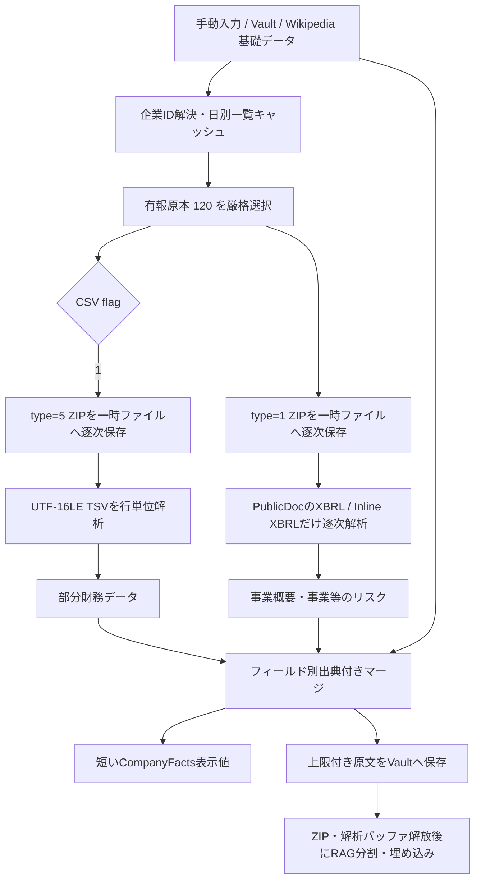

# EDINETレーン凍結解除 — 上位アーキテクチャ向け評価報告書

- 作成日: 2026-07-26
- 対象: Tauri v2 / Rust / React / iOS / ローカルLLM
- 判定: **条件付き承認（Go with guardrails）**
- 対象範囲: 有価証券報告書の発見、取得、財務・非財務情報の抽出、既存企業情報との統合、RAG投入

## 1. エグゼクティブサマリー

EDINETレーンの凍結解除は妥当であり、本アプリの価値を「一般的な企業紹介を返すローカルLLM」から「企業が法定開示した一次情報を根拠に面接準備を行うローカル分析環境」へ引き上げる。特に、業績サマリと「事業等のリスク」を出典・提出日・対象期間付きでRAGへ保存できれば、質問生成、回答評価、逆質問作成の具体性と説明可能性が大きく改善する。

ただし、現行実装の凍結点は「`commands_sim.rs` が `CompanyFacts::default()` を返していること」ではない。書類一覧API、固定URL検証、通信ポリシー、企業名照合、失敗時フォールバックは既に存在する。未接続なのは、一覧で取得した `docID` の後段にある以下の処理である。

1. `type=1` / `type=5` の書類ZIPを大容量レスポンス向け経路で取得する。
2. ZIPを安全に検査し、必要なエントリだけを逐次展開する。
3. XBRL-to-CSVから財務値を、Inline XBRL/XHTMLから事業等のリスクを抽出する。
4. フィールド別の出典を保持し、Wikipedia・手動編集・EDINETを正しい優先順位で統合する。
5. 抽出用バッファを解放してから、別フェーズでRAGへ投入する。

したがって、`CompanyFacts::default()` の単純削除は不適切である。これは企業名だけを入れた安全な基礎値を組み立てるための初期化であり、削除すると企業名検索とWikipediaフォールバックを壊す。実装ミッションは「既存の一覧検索とフェイルセーフを維持したまま、選択済み `docID` の後段を実装すること」と定義し直す。

承認条件は次の4点である。

- ZIP全体やDOM全体を `Vec<u8>` / `String` / DOMツリーとして保持しない。
- LLM推論・埋め込みとEDINET展開を同時実行しない。
- EDINET処理の全失敗を部分成功または基礎データへのフォールバックとして扱う。
- 実機で追加 `phys_footprint` とJetsam発生率を計測し、リリースゲートにする。

## 2. 現行実装の監査結果

### 2.1 既に存在するもの

現行リポジトリには以下が実装済みである。

- `apps/desktop/src-tauri/src/knowledge/edinet_client.rs`
  - EDINET API v2の固定ホスト・固定パス
  - 書類一覧URLの生成と送信前検証
  - `documents.json` の解析
  - EDINETコード・正規化企業名による候補選択
  - 一覧メタデータからの疎な `CompanyFacts` 生成
  - 外部テキストのサニタイズ
  - `type=1` ダウンロードURLと未使用の `fetch_document_bytes`
- `apps/desktop/src-tauri/src/llm/commands_sim.rs`
  - 永続化されたNetwork Policyと `egress-live` featureの二重ゲート
  - APIキー不在、通信失敗、解析失敗時の基礎データへのsoft-fail
  - EDINETコード検索と正規化企業名検索の分岐
- `apps/desktop/src-tauri/src/knowledge/net_gateway.rs`
  - HTTPS限定、redirect禁止、proxy禁止
  - DNS解決後のSSRF deny-table
  - 接続・全体deadline
  - `HttpTransport` / `ResponseBody` によるテスト可能な通信境界
  - `reqwest::` の利用を当該ファイルだけに制限する憲法テスト
- `apps/desktop/src-tauri/src/monitor/` と `llm/service.rs`
  - iOS Jetsam会計値に近い `phys_footprint`
  - 段階的なメモリ劣化状態
  - 実行中生成のcancelと常駐GGUFのpurge

### 2.2 真の凍結点

`fetch_document_bytes` はレスポンス全体を `Vec<u8>` に蓄積し、Wikipedia等と共通の `MAX_RESPONSE_BYTES = 1 MiB` を使う。このため、数MB以上のEDINET ZIPは正常系でも `WireViolation` になる。また、ZIP取得関数の呼出箇所はなく、ZIP・XBRL・CSVの解析器も存在しない。

共通上限を数十MBへ引き上げてはならない。Wikipedia JSONの小さい信頼境界を弱め、さらに圧縮ZIPと展開データを同時にヒープへ保持するからである。必要なのは、EDINET専用の「上限付きチャンクストリーム → 一時ファイル」経路である。

### 2.3 同時に是正すべき既存リスク

- 書類一覧の企業名検索は最大22日を直列走査するが、年次有報は通常この窓外にある。「最新有報」を保証できない。
- 一覧APIには企業名・EDINETコード検索パラメータがなく、日別一覧をクライアントで絞る必要がある。
- `select_yuho_document` は有報がなければ同一企業の任意書類へフォールバックするため、本番抽出レーンでは誤書類を採用し得る。
- `docTypeCode=130` の訂正有報を原本と同一視すると、部分的な訂正内容を完全な有報として扱う危険がある。
- 企業名検索中の認証失敗も日別エラーとして握り潰され、不要な再試行を続ける。
- 現行 `CompanyFacts` は単一の `source: String` しか持たず、Wikipediaの事業概要とEDINETのリスクが混在した状態を正確に表現できない。
- 現行の「既存の非空フィールドを優先する」マージでは、先に入ったWikipedia事業概要がEDINET一次情報に置き換わらない。
- `MAX_FACT_FIELD_BYTES = 4,096`、総量上限 `12,000` に対し、3フィールドが各上限まで入ると12,288 bytesとなり自己矛盾する。
- 書類一覧JSONにも共通1MiB上限と `serde_json::Value` による全体構築が適用され、さらに先頭500件だけを保持するため、提出集中日の対象企業を取りこぼし得る。
- `PKB_EDINET_API_KEY` 環境変数だけでは、配布iOSアプリでの安全なキー供給経路にならない。

これらはZIP解析だけを追加しても解決しないため、凍結解除の受入条件に含める。

## 3. 戦略的意義

### 3.1 UXへの直接効果

Wikipediaレーンは企業の輪郭を短時間で補うのに適している。一方、面接で差が出るのは「その企業が何をしているか」だけではなく、「直近年度に何が伸び、何を重大リスクとして認識し、どの事業へ資源を配分しているか」を自分の経験と結び付けられるかである。

EDINETの法定開示をRAGへ入れると、次の体験が実現できる。

- 「売上が増えた」という一般論ではなく、対象期間・連結区分・単位を伴う業績を根拠に質問できる。
- 企業自身が列挙した事業等のリスクから、応募職種に関係するリスクを選び、具体的な深掘り質問を生成できる。
- 回答評価時に「一次情報と整合しているか」「抽象論に逃げていないか」を判定できる。
- 逆質問を、ニュースの受け売りではなく、提出書類の記載と自分の仮説の差分として組み立てられる。
- 各回答に `docID`、提出日、対象期間、抽出概念を付け、ユーザーが根拠へ戻れる。
- 一度取得してVaultへ保存すれば、以後は通信せずローカルRAGとして利用できる。

重要なのは「LLMへ長文を丸ごとプロンプト注入すること」ではない。原文を上限付きでVaultへ保存・分割し、質問ごとに必要なチャンクだけを検索することで、コンテキストを浪費せず一次情報の価値を得る。

### 3.2 競争優位性

本機能は次の組合せにより差別化要因になる。

- 法定開示の一次情報
- ローカル保存・ローカル推論
- 応募者自身の経験データとの横断RAG
- 面接質問、回答評価、逆質問への一貫利用
- フィールド単位の出典と更新日

一般的なWeb検索型AIは最新情報を広く扱える反面、企業同定、出典の混在、セッション外での再利用、応募者個人データの扱いに弱い。本アプリは「企業一次情報 × 個人のローカル記録」を端末内で接続できる点が優位性になる。

ただし、EDINETは提出者による法定開示であり、将来予測の正しさを保証するものではない。UIとLLMプロンプトでは「公的機関が内容を保証した情報」ではなく「EDINETから取得した提出者開示」と表現する。

### 3.3 成功指標

機能完成を「ZIPが開けた」ではなく、以下で評価する。

- 対象企業の正しい有報原本を選択できた率
- 財務主要項目の抽出率と期間・連結区分の正解率
- 事業等のリスクの抽出率、全文性、誤セクション混入率
- フィールドごとの `docID` / 提出日 / 対象期間の保存率
- Wikipediaのみの場合と比較した質問具体性・回答根拠性
- 失敗時にWikipedia・手動入力が失われない率 100%
- 実機でのJetsam 0件、処理追加ピークメモリの予算内率

## 4. 推奨アーキテクチャ



### 4.1 フェーズ分離

処理は以下の3フェーズに明確に分ける。

1. **Discovery / Fetch**
   - 一覧取得、候補選定、ZIPの一時ファイル保存
   - LLMは起動しない
2. **Extract / Persist**
   - ZIPエントリを1つずつストリーム解析
   - 抽出済み証拠を上限付きでVaultへ保存
   - ZIP、inflater、XML/CSVバッファを解放
3. **Index / Generate**
   - 必要になった時点でLLMを再ロード
   - 保存済み証拠を小さく分割し、逐次埋め込み
   - 質問時は関連チャンクだけを取得

ZIP解析と埋め込みを同じ関数内で連続的に行い、両方の大きな状態を同時に保持してはならない。

### 4.2 「オンメモリ展開」の再定義

要件中の「ZIPファイルのダウンロードとオンメモリ展開」は、iOSでは次の意味に限定する。

- 永続的な展開ディレクトリを作らない。
- 圧縮ZIPはアプリのcache directory内の一時ファイルへストリーム保存する。
- `ZipArchive<File>` で中央ディレクトリを読み、選択した1エントリだけを逐次展開する。
- 展開データは小さい固定バッファを通してパーサーへ渡し、`read_to_end` / `read_to_string` を使わない。
- 処理終了、cancel、失敗のすべてで一時ファイルを削除する。

ZIPは中央ディレクトリ参照のため `Read + Seek` を必要とする。圧縮ZIP全体を `Vec<u8>` に保持する文字どおりのオンメモリ方式は、Jetsam対策と両立しないため不採用とする。

### 4.3 書類発見と「最新」の定義

EDINET書類一覧APIは日付単位であり、企業検索APIではない。したがって「最新有報」を正確に求めるには、日別一覧のローカル索引が必要である。

推奨は次の二段階である。

- 通常運用: 一覧APIを原則1分より短い間隔で再取得せず、日別レスポンスから120/130等の必要metadataだけを正規化してVaultへキャッシュし、`edinetCode + docTypeCode + submitDateTime` の索引を更新する。巨大なraw JSONを日付ごとに永続化しない。
- キャッシュ未構築時: 既知の提出日または決算期から導いた限定窓だけを走査し、見つからなければ「未発見」として基礎データへ戻す。数百日を対話中に総当たりしない。

Wikipedia用の共通1MiB上限は変更せず、一覧APIにもEDINET専用の有限上限とストリーム型JSON visitorを設ける。`results` 全体を `serde_json::Value` として保持せず、全行を検査しながら該当候補だけを小さい上限付き配列へ残す。先頭500件という位置依存の切捨ては廃止する。

「過去21日で最初に見つかったもの」を「最新有報」と表示してはならない。完全な最新性が必要なら、バックグラウンド索引の初期構築、既知提出日の供給、またはサーバー側索引のいずれかを別途承認する必要がある。

候補は最低でも以下を保持し、厳格に選別する。

- `docID`
- `edinetCode`
- `docTypeCode`
- `submitDateTime`
- `parentDocID`
- `withdrawalStatus`
- `disclosureStatus`
- `legalStatus`
- `xbrlFlag`
- `csvFlag`

初期リリースは非取下げ・開示中・閲覧可能な `docTypeCode=120` の原本だけを採用する。`130` は `parentDocID` で原本に結び付け、非空の訂正項目だけを上書きする別フェーズとする。訂正有報を単独の完全原本として扱わない。

### 4.4 財務データ

財務は `csvFlag == "1"` の場合、書類取得API `type=5` のXBRL-to-CSVを優先する。公式CSVは拡張子が `.csv` でも、UTF-16LE、CRLF、タブ区切り、全項目引用符付きの実質TSVである。

抽出は以下の順序とする。

1. BOMと文字コードを確認し、固定バッファでUTF-8へ逐次変換する。
2. TSVを1行ずつ読み、列数と最大列長を検証する。
3. 要素IDのallowlistだけを採用する。
4. 当期、連結、対象期間、単位を明示的に選択する。
5. 値・単位・context・要素IDを一体で保存する。
6. 同一概念に複数候補がある場合は「最初の値」を採らず、選択規則で一意にならなければ未取得とする。

業績サマリの初期対象は、売上・営業利益・税引前利益または当期利益・総資産・純資産・営業キャッシュフロー等の少数に限定する。J-GAAP、IFRS、US-GAAPと年度別タクソノミで要素IDが変わるため、allowlistはバージョン管理し、未知概念を推測でマッピングしない。

CSVのテキスト値は公式仕様上30,000文字で打ち切られるため、事業等のリスクの全文取得に `type=5` を使用してはならない。

### 4.5 非財務データ

「事業等のリスク」は `type=1` ZIP内の `XBRL/PublicDoc` を対象にする。固定ファイル名 `risk.html` を仮定せず、`*_ixbrl.htm`、`.xbrl` 等の候補を上限付きで走査する。

初期抽出は以下を優先する。

1. Inline XBRLの `ix:nonNumeric` またはXBRL factで、local nameが `BusinessRisksTextBlock` 等のallowlistに一致するもの
2. `DescriptionOfBusinessTextBlock`
3. 経営者による財政状態・経営成績・キャッシュフロー分析のtext block
4. 上記概念がない場合のみ、見出し状態機械による限定フォールバック

namespace prefix自体は固定せず、解決後のnamespaceまたはlocal nameを検証する。`continuedAt` によるInline XBRL継続も、件数・総文字数を制限した状態で連結する。

外部DTD、外部schema、画像、CSS、JavaScript、リンク先は取得しない。`DOCTYPE` は拒否する。XMLとして不正な旧式HTMLは初期版ではsoft-failし、必要性が実機コーパスで確認された場合だけHTML tokenizerを追加する。その場合もDOM TreeBuilderは使わない。

### 4.6 出典とマージ

単一の `CompanyFacts.source` では不十分である。少なくとも内部表現として、各フィールドに次を持たせる。

- 値
- source kind: manual / edinet / wikipedia / vault
- `docID`
- 提出日時
- 対象期間
- 抽出概念
- truncated / partial

推奨優先順位は以下である。

1. ユーザーの明示的な手動編集
2. EDINET一次開示
3. Wikipedia
4. 空値

ただし、EDINETの一つのフィールドが失敗したためにWikipediaの別フィールドを消してはならない。非空・検証済みフィールドだけをマージし、部分成功を正式な状態として扱う。

原文証拠と `CompanyFacts` を分離する。

- `CompanyFacts`: UIと短いプロンプト用。現行4KiB級のフィールド上限を維持し、総量上限との不整合を修正する。
- `EdinetEvidenceSection`: RAG用。本文を上限付きで保存し、`docID` と抽出概念を保持する。

全文が安全上限を超えた場合は黙って切らず、`truncated=true` を保存してUI・診断で確認可能にする。

EDINET本文も外部証拠であり、LLMへの命令として信頼しない。タグ除去後も既存render guardと同じサニタイズをRAG chunk単位で適用し、system promptへ直接連結せず引用境界内に置く。

## 5. 技術選定の妥当性

| 用途 | 選定 | 理由 | 不採用 |
|---|---|---|---|
| HTTP | 既存 `reqwest = 0.13.4` + `rustls`、`net_gateway.rs` 経由 | 既存の固定送信先、redirect禁止、SSRF-safe DNS、timeout、feature isolationを再利用できる | 新しいHTTPクライアント、React直通信 |
| ZIP | `zip`、default features無効、Stored/Deflateのみ | `ZipArchive<File>`、エントリ単位Reader、展開量情報、パス検証、overlap検査を利用できる | ZIP全体の `Vec<u8>` 化、全件 `extract()` |
| XML/XBRL | `quick-xml` の `Reader<BufRead>` / `NsReader` | イベント駆動でscratch bufferを再利用でき、大規模XMLに対し使用量が入力全体に比例しない | `roxmltree`、DOM、Serdeによる文書全体deserialize |
| CSV/TSV | `csv-core`（高水準 `csv` 禁止） | caller-owned 固定バッファと `OutputFull` / `Field { record_end }` | ファイル全体の `String` 化、`split('\n')`、改行探索での行破棄 |
| 文字コード | 既存 `encoding_rs` または薄い `encoding_rs_io` | UTF-16LEを固定バッファでUTF-8へ変換できる | 一括 `decode()` 後の巨大 `Cow<str>` 保持 |
| 一時ファイル | `tempfile` + Tauri app cache path | 衝突しない作成、RAII cleanup、`Read + Seek` を満たす | Documents領域への永続展開、API keyを含むファイル名 |
| cancel | `tokio-util::sync::CancellationToken` または同等の既存原子token | download、ZIP、XML、CSVの各ループで協調cancelできる | `JoinHandle::abort()` だけに依存 |

依存関係の初期候補は次のとおりである。実装時はリポジトリのexact-pin方針に従い、`cargo add --dry-run`、feature tree、iOS cross-compileを確認してから確定する。

```toml
quick-xml = { version = "=0.41.0", default-features = false, features = ["encoding"] }
zip = { version = "=8.6.0", default-features = false, features = ["deflate-flate2"] }
flate2 = { version = "=1.1.9", default-features = false, features = ["rust_backend"] }
csv-core = "=0.1.13"
encoding_rs_io = "=0.1.7"
tempfile = "=3.27.0"
tokio-util = { version = "=0.7.18", default-features = false, features = ["rt"] }
```

補足:

- `quick-xml 0.41.0` と `tokio-util 0.7.18` は現行lockfileに推移依存として存在するが、直接利用するなら `Cargo.toml` に直接依存として宣言する。
- `zip` のdefault featuresはAES、bzip2、lzma、xz、zstd等を含むため、必ず無効化する。
- **`deflate-flate2-zlib-rs` は採用しない。** 既存 `png`/Tauri 経由の `flate2` `rust_backend`/`miniz_oxide` に feature anchor で統一し、二重 backend を避ける（Phase 0 条件付き承認）。
- EDINETのZIPで必要なStored/Deflate以外は拒否し、iOSバイナリサイズと攻撃面を増やさない。
- `reqwest::` は引き続き `net_gateway.rs` 以外に記述しない。
- ZIP/XML解析は同期I/Oであるため `spawn_blocking` へ隔離する。ただしblocking taskは開始後のabortだけでは止まらないため、各ループでcancel tokenを確認する。

## 6. iOS Jetsamリスク評価

### 6.1 リスク評価

総合リスクは **高** である。

3B〜8Bの量子化モデルは重みだけでも大きく、これにKV cache、Metal buffer、tokenizer、WebView、Vault、画像等が加わる。iOSの終了閾値はデバイスと実行時状態に依存し、固定値ではない。Appleは、アプリがデバイス固有のメモリ上限を超えるとiOSが終了させること、低メモリ警告後も圧力が解消しなければJetsamが発生することを説明している。

EDINET処理で特に危険なのは次の重複保持である。

- HTTPレスポンス全体
- 圧縮ZIP全体
- 展開済みXBRL/HTML全体
- DOMツリー
- 抽出後の全文 `String`
- LLM重み・context・KV cache

入力30MBを `Vec<u8>`、展開100MB、UTF-8 `String`、DOMノードとして重ねると、短時間で数百MBのdirty memoryになり得る。メモリ警告を待ってから解放する設計では遅い。

### 6.2 回避方針

#### Heavy-operation gate

LLM生成、埋め込み、モデルloadとEDINET download/extractは、共通のheavy-operation coordinatorで排他する。iOSではEDINET開始前に以下を行う。

1. 新規LLM処理の受付を一時停止する。
2. 実行中生成をcancelする。
3. 必要なら `LlmMemoryGovernor::request_purge()` でGGUFを解放する。
4. `is_loaded() == false` と十分なheadroomを確認する。
5. EDINET処理を開始する。
6. 全アーカイブ・inflater・parser bufferをdropする。
7. LLMはユーザーが次に必要とした時だけ遅延再ロードする。

モデルpurgeを要求したが完了確認できない場合は、EDINET処理を始めずWikipedia基礎データへ戻す。

#### Headroom gate

既存 `phys_footprint` と、可能ならAppleの `os_proc_available_memory()` を参考にする。後者は現在値でありキャッシュせず、上限ぎりぎりまで使う目的に利用しない。

初期値は実機で調整する暫定値として以下を推奨する。

- 開始に必要なheadroom: 256 MiB
- cancel / purge境界: 128 MiB
- EDINET処理による追加 `phys_footprint` 目標: P95 24 MiB以下
- 同時EDINET job: 1
- `type=1` と `type=5`: 常に直列

絶対値はデバイス別Jetsam閾値ではなく、安全側の初期運用値である。A/Bではなく実機コーパスで調整する。

#### Low-memory / lifecycle

- memory warning、Serious/Critical、background遷移でEDINET cancel tokenを立てる。
- callback内では原子状態の更新だけを行い、ファイルcloseや大きなdropはworker側で行う。
- cancel後も全ループが速やかに終了するよう、HTTP chunk、ZIP entry、XML event、CSV rowごとに確認する。
- 途中まで抽出した値を「完全」として保存しない。検証済みフィールドだけをpartialとして保存する。
- 未保存のユーザー入力を先にVaultへ保存する。

### 6.3 ZIP bomb / adversarial input

EDINETは固定送信先であっても、外部バイナリは信頼境界外として扱う。以下は暫定の工学的予算であり、公式最大値ではない。

| 項目 | 初期上限 |
|---|---:|
| 圧縮アーカイブ | 64 MiB |
| central directory | 2 MiB |
| ZIP entry数 | 512 |
| 単一XHTML/XBRL entry | 32 MiB |
| 単一UTF-16 TSV entry | 64 MiB |
| 選択entryの総展開量 | 96 MiB |
| 解析候補ファイル数 | 16 |
| RAG用単一セクション | 128 KiB |
| RAG用抽出総量 | 256 KiB |
| download deadline | 30秒 |
| blocking parse deadline | 20秒 |
| job全体 | 60秒 |

公式の提出ZIPは圧縮後100MBまで許容されるため、64MiB上限は一部の正常書類を拒否し得る。これはiOS初期リリースの意図したsoft-failであり、拒否率と実機メモリを計測してから引き上げる。

必須検査:

- ZIP64、複数ディスク、暗号化、nested archive、未許可圧縮方式を拒否
- EOCD / central directoryを小さくpreflight
- `archive.len()` と総展開量を検証
- `has_overlapping_files()` が真なら拒否
- `enclosed_name()` で絶対パス、`..`、不正パスを拒否
- `XBRL/PublicDoc` / `XBRL_TO_CSV` のallowlist以外を読まない
- 宣言サイズだけを信用せず、実際に読んだbyte数でも停止
- 対象entryは最後まで読み、CRC検証を完了
- `extract()`、`read_to_end()`、`read_to_string()` を禁止

## 7. API・運用上のリスク

### 7.1 EDINET固有のレスポンス判定

書類取得APIはエラー時にもHTTP 200を返し得る。ZIP成功は `Content-Type: application/octet-stream`、失敗はJSONであるため、HTTP statusだけで成功判定してはならない。

さらに、エラーJSONは400/404/500系と401/429系でshapeが異なる。メンテナンス時にはHTMLのSorry画面や無応答もあり得る。以下を順に検証する。

1. HTTP status
2. `Content-Encoding` がidentityまたは未指定
3. `Content-Type`
4. ZIP magic
5. JSONの場合は両方のエラーshape

API error本文をZIP parserへ渡してはならない。

### 7.2 レートとキャッシュ

EDINET一覧は原則1分単位で更新され、公式FAQは1分1回以下の利用を推奨している。日付ごとの一覧をキャッシュし、同一日を企業ごとに再取得しない。

- 400/401/404: 自動再試行しない
- 429: 十分に間隔を空け、当該jobでは基礎データへ戻す
- 500/timeout: 少数回の上限付きbackoffのみ
- cancel / background: 再試行しない

完全URLにはAPIキーが含まれるため、URL、query、reqwest error chainをログへ出さない。

### 7.3 APIキー

Version 2のAPIキーは必須である。配布バイナリへの共有キー直書きは抽出され得るうえ、全ユーザーが同一keyへ集中して429・失効の単一障害点になる。

ローカル専用方針を維持するなら、ユーザー自身のキーを設定画面から受け取りKeychainへ保存する方式が最も整合する。運営共有keyを使う場合はサーバーproxyが必要になるが、これは「ローカル完結」という製品境界を変更するため、別の上位判断を要する。

## 8. フェイルセーフ契約

EDINETは「基礎データを増強する任意レーン」であり、企業画面を成立させる必須依存ではない。

外側の契約:

```text
base = 手動入力 / Vault / Wikipediaから得た安全なCompanyFacts
try:
    partial = EDINETから取得・検証できたフィールド
    return merge_by_field_provenance(base, partial)
catch any EDINET error:
    return base
```

以下のいずれでも `panic!`、`unwrap()`、`expect()` を使わず、基礎データを返す。

- EDINETコードなし
- 一覧に対象書類なし
- APIキーなし・失効
- policy off / feature off
- DNS・TLS・timeout・429・500
- error JSON / HTML maintenance page
- ZIP上限超過・CRC不正・不正パス
- CSV/XBRL/HTML解析失敗
- unsupported taxonomy / encoding
- cancel / background / memory pressure
- LLM purge未完了

`ReqwestTransport::new()` の失敗もこのfallback境界の内側で捕捉する。片方のレーンだけ成功した場合、例えば財務失敗・リスク成功なら、リスクだけをEDINET由来として返す。

## 9. 実装フェーズとリリースゲート

### Phase A — 契約と依存関係

- Cargo依存候補、feature、関数シグネチャ、エラー型、limit型を提示
- コード変更前にレビュー
- 現行feature matrixと憲法テストへの影響を確認

### Phase B — 大容量downloadとZIP guard

- Wikipediaの1MiB上限を変更せず、EDINET専用stream-to-tempを追加
- fake transportのみで上限、deadline、cancel、cleanupをテスト
- ZIP bomb / traversal / overlap fixturesを追加

### Phase C — 財務抽出

- UTF-16LE TSV decoder
- allowlist概念、当期・連結・単位選択
- golden fixturesで値とprovenanceを検証

### Phase D — 非財務抽出

- Inline XBRL / XBRL text blockのイベント駆動抽出
- namespace、`continuedAt`、malformed、DOCTYPE、上限をテスト
- HTML見出しfallbackは必要最小限

### Phase E — 統合とRAG

- フィールド別provenance
- manual > EDINET > Wikipediaのmerge
- 原文証拠と短い `CompanyFacts` の分離
- アーカイブ解放後の逐次RAG投入

### Phase F — iPhone実機

最低でも、最小サポート端末と代表的な新端末で以下を測定する。

- LLM未ロード、3Bロード後、最大対応モデルロード後
- type=1のみ、type=5のみ、両方
- 正常、上限直前、上限超過、cancel、background、memory warning
- 連続10社取得

リリース条件:

- Jetsam 0件
- 基礎データ消失 0件
- main thread stallなし
- 一時ファイル残留 0件
- 追加 `phys_footprint` が承認予算内
- 公式fixtureの抽出精度が受入値以上
- offline/default testで外部通信 0件

## 10. 最終判断

本実装は製品戦略上の優先度が高く、技術的にもRustのストリーム処理と既存の安全なegress境界を使えば実現可能である。一方、ZIP全体のオンメモリ保持、DOM解析、LLMとの同時実行のいずれかを許す設計は、iOSでは承認できない。

次フェーズへのGo条件は次のとおりである。

1. 実装AIの最初の出力をCargo依存と関数シグネチャ設計だけに限定する。
2. download-to-temp、逐次展開、stream parserを設計契約にする。
3. 「最新有報」発見の索引戦略と訂正有報の扱いを明文化する。
4. フィールド別provenanceと基礎データfallbackを受入条件にする。
5. iPhone実機の `phys_footprint` / Jetsam計測をリリースゲートにする。

## 11. 参照資料

- [金融庁 EDINET API仕様書 Version 2（2026年6月）](https://disclosure2dl.edinet-fsa.go.jp/guide/static/disclosure/download/ESE140206.pdf)
- [金融庁 EDINET API FAQ](https://disclosure2dl.edinet-fsa.go.jp/guide/static/disclosure/WZEK0090_001.html)
- [金融庁 書類閲覧操作ガイド（CSV仕様）](https://disclosure2dl.edinet-fsa.go.jp/guide/static/disclosure/download/ESE140133.pdf)
- [金融庁 提出書類ファイル仕様書](https://disclosure2dl.edinet-fsa.go.jp/guide/static/disclosure/download/ESE140104.pdf)
- [金融庁 報告書インスタンス作成ガイドライン](https://disclosure2dl.edinet-fsa.go.jp/guide/static/disclosure/download/ESE140112.pdf)
- [金融庁 EDINET利用規約](https://disclosure2dl.edinet-fsa.go.jp/guide/static/disclosure/WZEK0030.html)
- [Apple: Reducing your app's memory use](https://developer.apple.com/documentation/xcode/reducing-your-app-s-memory-use)
- [Apple: Responding to memory warnings](https://developer.apple.com/documentation/uikit/responding-to-memory-warnings)
- [Apple: Identifying high-memory use with jetsam event reports](https://developer.apple.com/documentation/xcode/identifying-high-memory-use-with-jetsam-event-reports)
- [Apple: os_proc_available_memory](https://developer.apple.com/documentation/os/os_proc_available_memory)
- [quick-xml Reader](https://docs.rs/quick-xml/0.41.0/quick_xml/reader/struct.Reader.html)
- [zip ZipArchive](https://docs.rs/zip/8.6.0/zip/read/struct.ZipArchive.html)
- [csv ReaderBuilder](https://docs.rs/csv/1.4.0/csv/struct.ReaderBuilder.html)
