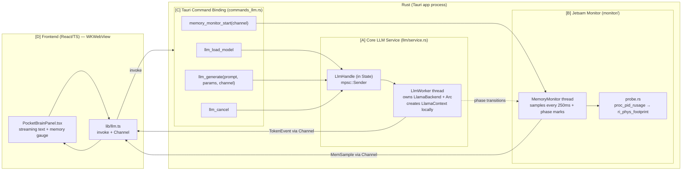

# Pocket Brain — On-Device LLM Architecture Blueprint

> **読者:** Cursor Composer（自律実装 AI）。**この文書は Spike で実証済みの事実だけに基づく。未検証の iOS API・存在しない `llama-cpp-2` ラッパーをでっち上げるな。**
> **前提ブランチ:** 検証は `spike/m0-pocket-brain-jetsam-test`（コミット `422fe31`）で実施。本 blueprint はその成果を M4 本実装へ昇格させるための設計図。
> **凍結規律:** 既存 desktop（Windows/macOS）の挙動は byte-identical に保つ。新規コードはすべて Cargo feature `pocket-brain` ＋ `#[cfg(mobile)]` 相当のコンパイル時分岐で隔離し、default ビルドに一切混ぜない。

---

## 0. Verified API Surface（推測禁止の根拠 — Composer はこの表の外の API を発明するな）

`llama-cpp-2` v0.1.151 で**ソース実地確認済み**のシンボルだけを使う。

| 用途 | 検証済みシグネチャ | 備考 |
|---|---|---|
| backend | `LlamaBackend::init() -> Result<LlamaBackend>` | プロセスで1回。`Send`可 |
| model params | `LlamaModelParams::default().with_n_gpu_layers(u32).with_use_mmap(bool)` | mmap=true で weights は clean page |
| model load | `LlamaModel::load_from_file(&LlamaBackend, impl AsRef<Path>, &LlamaModelParams) -> Result<LlamaModel, LlamaModelLoadError>` | `LlamaModel: Send + Sync`（`Arc`共有可） |
| ctx params | `LlamaContextParams::default().with_n_ctx(Option<NonZeroU32>)` | `with_n_batch`/`with_n_threads` は**未確認 — 使うな**。既定値のまま |
| context | `model.new_context(&LlamaBackend, LlamaContextParams) -> Result<LlamaContext<'a>, LlamaContextLoadError>` | **`LlamaContext` は `Send`/`Sync` 実装なし＋model を `'a` で借用** |
| tokenize | `model.str_to_token(&str, AddBos) -> Result<Vec<LlamaToken>, _>` | `AddBos::{Always,Never}` |
| batch | `LlamaBatch::new(n_tokens: usize, n_seq_max: i32)` / `.add(LlamaToken, pos: i32, seq_ids: &[i32], logits: bool) -> Result<(),_>` / `.n_tokens() -> i32` | |
| decode | `ctx.decode(&mut LlamaBatch) -> Result<(), DecodeError>` | |
| sampler | `LlamaSampler::greedy()` / `::chain_simple(impl IntoIterator<Item=Self>)` / `::temp(f32)` / `::top_k(i32)` / `::top_p(f32, usize)` / `::dist(seed: u32)` | |
| sample | `sampler.sample(&LlamaContext, idx: i32) -> LlamaToken` / `sampler.accept(LlamaToken)` | idx = `batch.n_tokens() - 1` |
| detok | `model.token_to_str(LlamaToken, Special) -> Result<String, _>` | 出力表示は `Special::Plaintext` |
| stop | `model.is_eog_token(LlamaToken) -> bool` / `model.token_eos()` | EOG 到達で生成終了 |

`libc` v0.2（apple target）で検証済み:

| 用途 | 検証済みシンボル |
|---|---|
| jetsam footprint | `libc::proc_pid_rusage(pid: c_int, RUSAGE_INFO_V2, *mut rusage_info_t)` → `rusage_info_v2.ri_phys_footprint: u64` |
| pid | `libc::getpid()` |

`tauri` v2.11.5:

| 用途 | 検証済み |
|---|---|
| ストリーミング | `tauri::ipc::Channel<TSend>`（コマンド引数として受領）＋ `channel.send(TSend) -> Result<()>` |
| パス解決 | `app.path().app_data_dir() -> Result<PathBuf>`（要 `use tauri::Manager`） |

> **未確認で使用禁止:** `with_n_batch` / `with_n_threads` ビルダー、`Emitter::emit`（Channel で代替）、`task_info(MACH_TASK_BASIC_INFO)`（`phys_footprint` を含まない — Spike で棄却済み）。

---

## 1. System Overview

**中核制約（この一点が全体構造を決める）:** `LlamaContext` は `Send` でなく、生成元 `LlamaModel` を lifetime で借用する。ゆえに **Tauri の共有 `State`（`Send + Sync` 必須）に context を置けない。** 解は「LLM を専有する単一 OS スレッド（ワーカー）を立て、backend・model・context をそのスレッド内に閉じ込める」こと。フロントとはコマンド（要求）と `Channel`（トークン/テレメトリのストリーム）で疎結合する。



**データフロー（1回の生成）:**
1. FE が `llm_load_model` を invoke → ワーカーが `app_data_dir()/models/pocket-brain.gguf` を mmap ロード。フェーズ `model_loaded` を Monitor へ通知。
2. FE が `llm_generate(prompt, params, tokenChannel)` を invoke。ワーカーが context 生成（`ctx_created`）→ prompt を decode → sampling ループで 1 トークンずつ生成し、各トークンを `tokenChannel.send(TokenEvent)`。フェーズ `inference`。
3. 並行して Monitor スレッドが 250ms 毎に `phys_footprint` を採取し `memChannel.send(MemSample)`。閾値超過見込みで `over_threshold=true` を立てる。
4. `is_eog_token` 到達 or `max_tokens` or cancel で終了。`TokenEvent{done:true}` を送出。

---

## 2. Directory Structure

```text
apps/desktop/
├── src-tauri/
│   ├── Cargo.toml                     # feature `pocket-brain` 追加（§3.1）
│   └── src/
│       ├── lib.rs                     # module 宣言 + invoke_handler 登録（cfg分岐）
│       ├── commands_llm.rs            # [C] Tauri commands（feature-gated）
│       ├── llm/
│       │   ├── mod.rs                 # 再輸出・LlmHandle・LlmState
│       │   ├── service.rs             # [A] LlmWorker（backend/model/context/生成ループ）
│       │   ├── params.rs              # GenerationParams・LoadParams
│       │   └── model_path.rs          # GGUF パス解決（App Container 準拠）
│       └── monitor/
│           ├── mod.rs                 # MemoryMonitor・MemPhase・MemSample
│           └── probe.rs               # proc_pid_rusage ラッパー（Spike の spike_probe を昇格）
└── src/
    ├── lib/
    │   └── llm.ts                     # invoke ラッパー + Channel 型 + イベント型
    └── components/
        └── PocketBrainPanel.tsx       # [D] ストリーミング表示 + メモリテレメトリ
```

> **凍結遵守:** 既存 `src-tauri/src/paths.rs` は触らない。GGUF パス解決は新規 `llm/model_path.rs` に隔離する。`commands.rs`/`engine.rs` 等 M0 凍結ファイルは不変。

---

## 3. File-by-File Specification

### 3.1 `Cargo.toml`（記述方針）

**方針:** llama.cpp と mach probe の依存はすべて `optional`＋`pocket-brain` feature 配下。default ビルドは一切引き込まない（desktop byte-identical）。`build.rs` は**不改変** — `metal` feature が CMake へ `-DGGML_METAL=ON` を渡す（Spike 実証済み）。

```toml
[dependencies]
# ... 既存 ...
llama-cpp-2 = { version = "=0.1.151", default-features = false, features = ["metal"], optional = true }

# Apple target のみ: jetsam probe 用 libc（既存の linux 用 libc とは別 target テーブル）
[target.'cfg(target_vendor = "apple")'.dependencies]
libc = "0.2"

[features]
# 本番オンデバイス LLM。cmake + C++ toolchain 必須。default では無効。
pocket-brain = ["dep:llama-cpp-2"]
```

> `libc` は feature ではなく `cfg(target_vendor="apple")` で常時可（probe は軽量・toolchain 非依存）。llama のみ feature-gate。

### 3.2 `src-tauri/src/monitor/probe.rs` — [B] footprint 取得（Spike 昇格）

**役割:** jetsam 台帳と一致する `phys_footprint` をバイト単位で返す唯一の真実。Spike の `spike_probe.rs` をそのまま昇格。

```rust
/// jetsam が課金する物理フットプリント（バイト）。取得不可なら None。
#[cfg(target_vendor = "apple")]
pub fn phys_footprint_bytes() -> Option<u64>;   // proc_pid_rusage(RUSAGE_INFO_V2).ri_phys_footprint
#[cfg(not(target_vendor = "apple"))]
pub fn phys_footprint_bytes() -> Option<u64>;   // None
```

依存: `libc`。**`MACH_TASK_BASIC_INFO` は使わない**（`resident_size` しか返さず jetsam 値でない）。

### 3.3 `src-tauri/src/monitor/mod.rs` — [B] Jetsam Monitor

**役割:** バックグラウンドスレッドで `phys_footprint` を周期採取し、フェーズ増分と閾値超過を `Channel<MemSample>` へ流す。

```rust
#[derive(Clone, Copy, serde::Serialize)]
#[serde(rename_all = "snake_case")]
pub enum MemPhase { Baseline, ModelLoaded, CtxCreated, Inference, Idle }

#[derive(Clone, serde::Serialize)]
pub struct MemSample {
    pub phase: MemPhase,
    pub phys_footprint_bytes: u64,
    pub delta_from_baseline_bytes: i64,
    pub threshold_bytes: u64,
    pub over_threshold: bool,      // phys_footprint >= threshold
    pub headroom_bytes: i64,       // threshold - phys_footprint
    pub t_ms: u64,                 // 監視開始からの経過
}

/// 監視ハンドル。現在フェーズは複数スレッドから更新されるので Atomic 経由。
pub struct MemoryMonitor {
    phase: std::sync::Arc<std::sync::atomic::AtomicU8>,   // MemPhase を u8 で保持
    baseline: std::sync::Arc<std::sync::atomic::AtomicU64>,
    running: std::sync::Arc<std::sync::atomic::AtomicBool>,
}

impl MemoryMonitor {
    pub fn new() -> Self;
    /// 別スレッドを spawn し、interval_ms 毎に sample を channel.send。
    /// threshold_bytes は G0-C.1 の設計目標（例: A17 Pro/8GB で 4.8GB = 60% 帯）。
    pub fn start(&self, ch: tauri::ipc::Channel<MemSample>, interval_ms: u64, threshold_bytes: u64);
    pub fn set_phase(&self, phase: MemPhase);   // ワーカーがフェーズ遷移時に呼ぶ
    pub fn stop(&self);
}
```

依存: `probe::phys_footprint_bytes`、`tauri::ipc::Channel`。**閾値はハードコードせず command 引数 or 設定から渡す**（機種依存。`os_proc_available_memory` 実測との併用は M4 で拡張）。

### 3.4 `src-tauri/src/llm/params.rs` — 生成・ロードパラメータ

```rust
#[derive(Clone, serde::Deserialize)]
pub struct LoadParams {
    pub n_gpu_layers: u32,   // 既定 999（全層 Metal offload）
    pub use_mmap: bool,      // 既定 true（clean page 維持）
}

#[derive(Clone, serde::Deserialize)]
pub struct GenerationParams {
    pub prompt: String,
    pub n_ctx: u32,          // 既定 2048（G0-C.4）
    pub max_tokens: u32,     // 生成上限
    pub temp: f32,           // 0.0 で greedy 相当
    pub top_k: i32,
    pub top_p: f32,
    pub seed: u32,
}
```

### 3.5 `src-tauri/src/llm/model_path.rs` — GGUF パス解決（堅牢性要件）

**役割:** iOS App Container を正確に参照。`current_dir`/`HOME` から**推測しない**（規律）。

```rust
use std::path::PathBuf;
use tauri::{AppHandle, Manager};

pub const MODEL_FILENAME: &str = "pocket-brain.gguf";

/// <app_data_dir>/models/pocket-brain.gguf を返す。app_data_dir は iOS で
/// アプリsandbox の Library/Application Support 配下（Tauri PathResolver 由来）。
/// ディレクトリが無ければ作成する（親 mkdir は書き込み側の責務）。
pub fn resolve_model_path(app: &AppHandle) -> Result<PathBuf, String>;
```

依存: `tauri::Manager::path().app_data_dir()`（Spike で iOS コンパイル確認済み）。

### 3.6 `src-tauri/src/llm/service.rs` — [A] Core LLM Service（心臓部）

**役割:** LLM 専有ワーカースレッド。backend/model/context をスレッド内に閉じ込め、コマンドを mpsc で受け、トークンを `Channel` でストリーム。

```rust
use std::sync::{mpsc, Arc};
use tauri::ipc::Channel;
use crate::llm::params::{GenerationParams, LoadParams};
use crate::monitor::{MemoryMonitor, MemPhase};

/// フロントへ 1 トークンずつ返すイベント。
#[derive(Clone, serde::Serialize)]
pub struct TokenEvent {
    pub seq: u32,
    pub text: String,      // token_to_str(_, Special::Plaintext)
    pub done: bool,
    pub error: Option<String>,
}

/// ワーカーへの命令。生成要求は返信用 Channel を同梱。
pub enum LlmCommand {
    Load { params: LoadParams, model_path: std::path::PathBuf, reply: mpsc::Sender<Result<(), String>> },
    Generate { params: GenerationParams, tokens: Channel<TokenEvent> },
    Cancel,
    Shutdown,
}

/// State に置くハンドル（Send + Sync）。context は決してここに入らない。
pub struct LlmHandle {
    tx: mpsc::Sender<LlmCommand>,
}

impl LlmHandle {
    /// ワーカースレッドを spawn し、backend を init して命令ループへ入る。
    /// monitor はフェーズ通知のため共有。
    pub fn spawn(monitor: Arc<MemoryMonitor>) -> Self;
    pub fn load(&self, model_path: std::path::PathBuf, params: LoadParams) -> Result<(), String>;
    pub fn generate(&self, params: GenerationParams, tokens: Channel<TokenEvent>);
    pub fn cancel(&self);
}
```

**ワーカーの生成ループ擬似コード（検証済み API のみ）:**

```text
let backend = LlamaBackend::init()?;                 // 1回
// Load:
let model = Arc::new(LlamaModel::load_from_file(&backend, &path,
                &LlamaModelParams::default()
                    .with_n_gpu_layers(p.n_gpu_layers)
                    .with_use_mmap(p.use_mmap))?);
monitor.set_phase(ModelLoaded);

// Generate:
let mut ctx = model.new_context(&backend,
                LlamaContextParams::default().with_n_ctx(NonZeroU32::new(g.n_ctx)))?;
monitor.set_phase(CtxCreated);

let tokens_in = model.str_to_token(&g.prompt, AddBos::Always)?;
let mut batch = LlamaBatch::new(tokens_in.len().max(1), 1);
for (i, t) in tokens_in.iter().enumerate() {
    batch.add(*t, i as i32, &[0], i == tokens_in.len() - 1)?;
}
ctx.decode(&mut batch)?;
monitor.set_phase(Inference);

let mut sampler = LlamaSampler::chain_simple([
    LlamaSampler::top_k(g.top_k),
    LlamaSampler::top_p(g.top_p, 1),
    LlamaSampler::temp(g.temp),
    LlamaSampler::dist(g.seed),
]);                                                  // temp==0 は greedy() に切替可
let mut n_cur = batch.n_tokens();
for seq in 0..g.max_tokens {
    if cancel_requested { break; }
    let tok = sampler.sample(&ctx, batch.n_tokens() - 1);
    if model.is_eog_token(tok) { break; }
    let piece = model.token_to_str(tok, Special::Plaintext).unwrap_or_default();
    tokens.send(TokenEvent { seq, text: piece, done: false, error: None })?;
    sampler.accept(tok);
    batch.clear();                                   // ※ clear() の実在は Composer が確認（無ければ new で作り直す）
    batch.add(tok, n_cur, &[0], true)?;
    n_cur += 1;
    ctx.decode(&mut batch)?;
}
tokens.send(TokenEvent { seq: .., text: String::new(), done: true, error: None })?;
monitor.set_phase(Idle);
```

> **Composer への注意:** `LlamaBatch::clear` は本 blueprint で未検証。存在すればそれを、無ければ各ステップで `LlamaBatch::new(1,1)` を作り直せ（推測で `clear` を呼ぶな — ビルドで確かめてから）。それ以外の呼び出しは §0 で実在確認済み。

### 3.7 `src-tauri/src/commands_llm.rs` — [C] Tauri Command Binding

```rust
use tauri::{AppHandle, State};
use tauri::ipc::Channel;

#[tauri::command]
pub async fn llm_load_model(app: AppHandle, handle: State<'_, LlmHandle>, params: LoadParams) -> Result<(), String>;
// resolve_model_path(&app) → handle.load(...)

#[tauri::command]
pub async fn llm_generate(handle: State<'_, LlmHandle>, params: GenerationParams, on_token: Channel<TokenEvent>) -> Result<(), String>;

#[tauri::command]
pub async fn llm_cancel(handle: State<'_, LlmHandle>) -> Result<(), String>;

#[tauri::command]
pub async fn memory_monitor_start(monitor: State<'_, Arc<MemoryMonitor>>, on_sample: Channel<MemSample>, interval_ms: u64, threshold_bytes: u64) -> Result<(), String>;
```

**`lib.rs` 配線（cfg 分岐）:**

```rust
#[cfg(feature = "pocket-brain")] mod commands_llm;
#[cfg(feature = "pocket-brain")] mod llm;
mod monitor;   // probe は常時（軽量）

// setup 内（mobile 経路）:
let monitor = std::sync::Arc::new(monitor::MemoryMonitor::new());
app.manage(monitor.clone());
#[cfg(feature = "pocket-brain")]
app.manage(llm::LlmHandle::spawn(monitor));

// invoke_handler に追加（feature-gate）:
#[cfg(feature = "pocket-brain")]
// commands_llm::llm_load_model, llm_generate, llm_cancel, memory_monitor_start
```

> generate_handler! は feature でリストを切り替える必要があるため、`tauri::generate_handler!` を `#[cfg]` で2分岐するか、常時登録の薄い stub（feature off 時は "not built" を返す）にする。M0 の spike_llm.rs が後者の実例。

### 3.8 `src/lib/llm.ts` — [D] FE ブリッジ

```ts
import { invoke, Channel } from "@tauri-apps/api/core";

export interface TokenEvent { seq: number; text: string; done: boolean; error: string | null }
export interface MemSample {
  phase: "baseline"|"model_loaded"|"ctx_created"|"inference"|"idle";
  phys_footprint_bytes: number; delta_from_baseline_bytes: number;
  threshold_bytes: number; over_threshold: boolean; headroom_bytes: number; t_ms: number;
}

export async function loadModel(p: {n_gpu_layers:number; use_mmap:boolean}): Promise<void>;
export function generate(params: GenerationParams, onToken: (e: TokenEvent) => void): Promise<void>; // new Channel<TokenEvent>()
export async function cancel(): Promise<void>;
export function startMemoryMonitor(onSample: (s: MemSample) => void, intervalMs: number, thresholdBytes: number): Promise<void>;
```

> `Channel` は `@tauri-apps/api/core` の `Channel`。`ch.onmessage = onToken; invoke("llm_generate", { params, onToken: ch })`。**Zustand/Redux 禁止**（規律）— 状態は純 reducer で。

### 3.9 `src/components/PocketBrainPanel.tsx` — [D] UI

**役割:** ストリーミングテキスト（トークン逐次追記）＋リアルタイム `phys_footprint` ゲージ（現在値／閾値／headroom、`over_threshold` で発光）。摩擦ゼロ UX 規律に従い、入力を `disabled` にせずアンビエント表現。状態は React 非依存の純 reducer（`pocketBrainReducer`）で管理し tests-runtime でテスト可能に。

---

## 4. Implementation Phasing（各フェーズ = ビルドが通る単位）

> 各フェーズ末で **`cargo check -p pkb-desktop`（default, GREEN 維持）** と、LLM を含むフェーズは **`cargo check --features pocket-brain --target aarch64-apple-ios-sim`** を必須ゲートにする。

**Phase 0 — 足場（llama 無し・default 緑）**
- `Cargo.toml` に feature `pocket-brain` と optional 依存を追加（まだ未使用）。
- `monitor/probe.rs`（spike_probe 昇格）＋`monitor/mod.rs`（MemoryMonitor・MemSample）を追加。probe は常時コンパイル。
- ゲート: default `cargo check` GREEN。

**Phase 1 — メモリテレメトリ縦断（LLM 無しで先に通す）**
- `commands_llm.rs` の `memory_monitor_start` だけ実装（feature 非依存で可）。`lib.rs` に MemoryMonitor を manage＋登録。
- `lib/llm.ts` の `startMemoryMonitor` ＋ `PocketBrainPanel.tsx` にメモリゲージ。
- ゲート: default `cargo check` GREEN、`tsc --noEmit` GREEN。シミュレータで baseline footprint がゲージに出る。

**Phase 2 — LLM ワーカー骨格（feature-gated・ロードのみ）**
- `llm/params.rs`・`llm/model_path.rs`・`llm/service.rs`（`LlmHandle::spawn`＋`Load` 命令まで。生成は未実装）。
- `llm_load_model` コマンド、`lib.rs` に feature-gate 登録。
- ゲート: `cargo check --features pocket-brain --target aarch64-apple-ios-sim` GREEN。GGUF 配置後、load で `model_loaded` フェーズ増分がゲージに反映。

**Phase 3 — 生成ループ + トークンストリーミング**
- `service.rs` に `Generate`（decode → sampling ループ → `Channel<TokenEvent>`）。`llm_generate`/`llm_cancel` コマンド。
- `lib/llm.ts` の `generate`／`PocketBrainPanel` の逐次表示。
- ゲート: 両 `cargo check` GREEN、`tsc` GREEN。シミュレータでプロンプト→トークン逐次表示、`ctx_created`／`inference` フェーズが footprint に現れる。

**Phase 4 — 実機 acceptance（G0-C.4）**
- 物理 A17 Pro で 4 フェーズ footprint 実測、`threshold` 帯（例 4.8GB）に対する headroom、20 分連続の thermal を計測。
- ゲート: dirty footprint ≤ 上限 60%、rubric（感情分析／家計簿 JSON 抽出）。**No-Go なら scope 再承認**。

---

## 5. 未解決事項（Composer は勝手に埋めず、実装中に検証せよ）

1. `LlamaBatch::clear` の実在（§3.6 注記）。無ければ per-step `LlamaBatch::new`。
2. `temp == 0.0` の扱い — `LlamaSampler::greedy()` へ分岐するのが安全（`temp(0.0)` の挙動は未検証）。
3. GBNF grammar 拘束 decoding（家計簿 JSON 抽出の G0-C.2 要件）は本 blueprint 未含。`llama-cpp-2` の grammar API（`grammar/` モジュールが存在）を M4 で別途検証して追加。
4. `threshold_bytes` の機種別確定値は `os_proc_available_memory` 実測と組で M4 で裁定（ハードコード禁止）。
